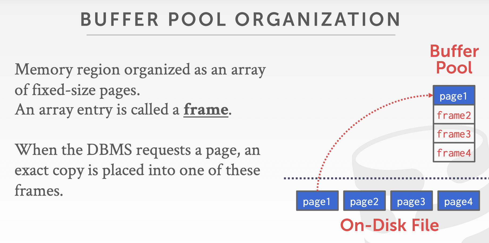
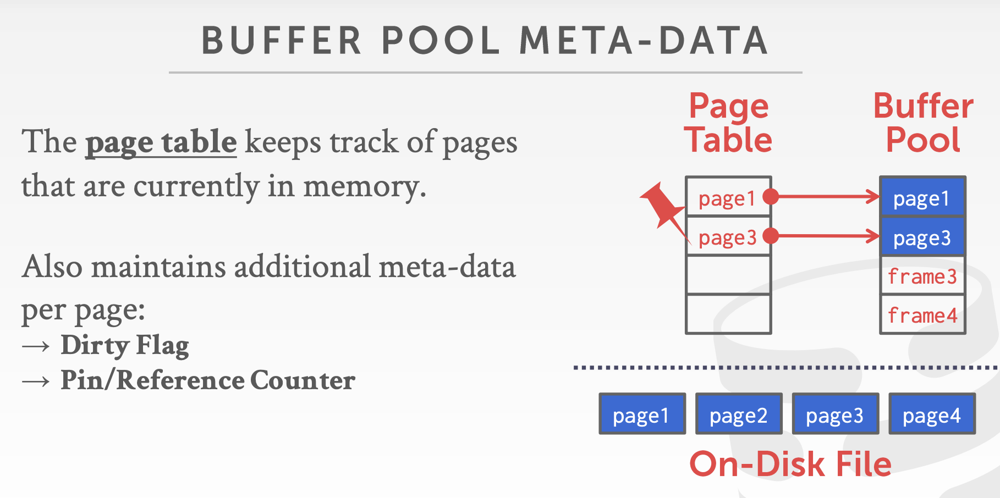

# How the DBMS manages to move data back-and-forth from disk

- Where？
  - 目的：控制使用时间上相近的数据在空间上相近

- When？
  - 目的：减少等待IO的时间

## Buffer Pool Organization

- **frame**：BufferPool中一个元素，page size 大小

  

- **Page table**:哈希表，maps page id -> frame location,附带一些metadata

  - dirty-flag：thread如果修改了page内容，会标，代表该page需要被写回
  - pin/reference counter：正在读写该page的thread数量，thread在访问page前先对counter++

## Buffer Pool Optimization

- Multiple Buffer Pool
  - Per Database buffer pool/Per Page type buffer pool
  - 减少latches的竞争，增加局部性
  - 方式：1. Object Id 2. Hashing函数
- Pre-fetch
  - Sequential Scan
  - Index Scan
- Scan sharing
  - Allow multiple queries to attach to a single cursor that scans a table.
- Buffer Pool Bypass
  - 读在连续page上的很大的数据的时候，可以绕过buffer pool

## Replacement Policies

- LRU和Clock都特别容易被sequential flooding影响

  - LRU

  - Clock(近似LRU)

- 改进
  - LRU-k：存储最近k次调用的timestamp，估算下一次调用的时间
  - Localization：每个事务/查询选择一次evict page
  - Priority hints：事务给个context关于哪个page important
- Evict时对dirty page处理：
  - 如果不dirty，可以直接drop
  - dirty，写回disk
  - DBMS可以周期性检查buffer，写回脏页；写回的页可以被drop或者清0dirty flag；在写回脏页前必须先写log records