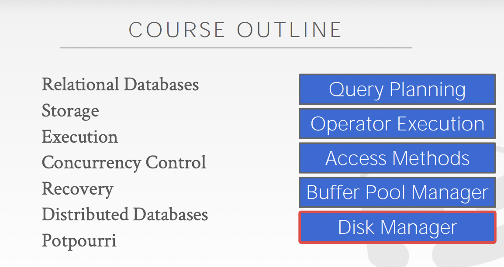
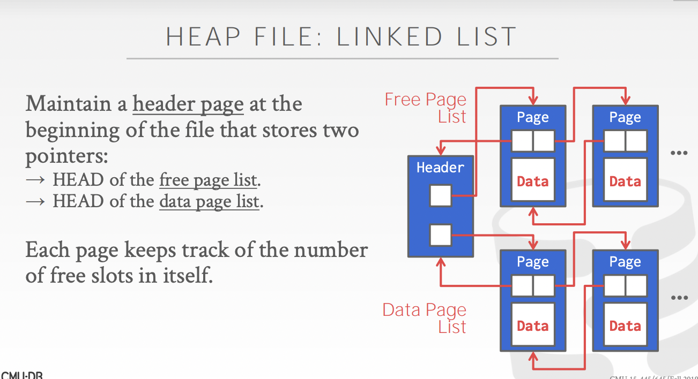
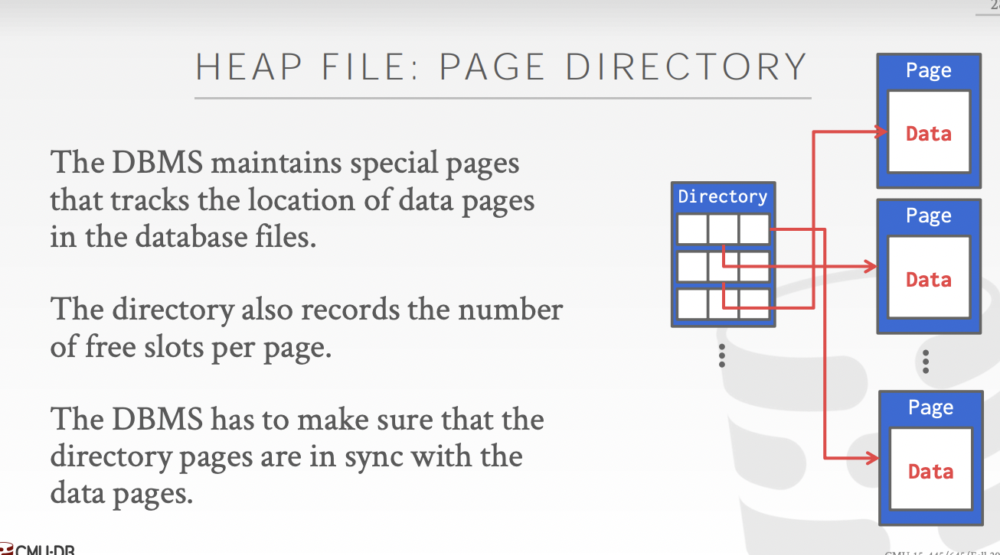
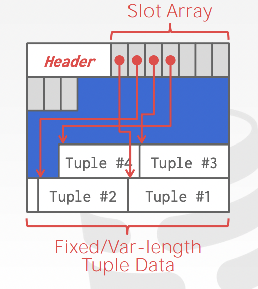
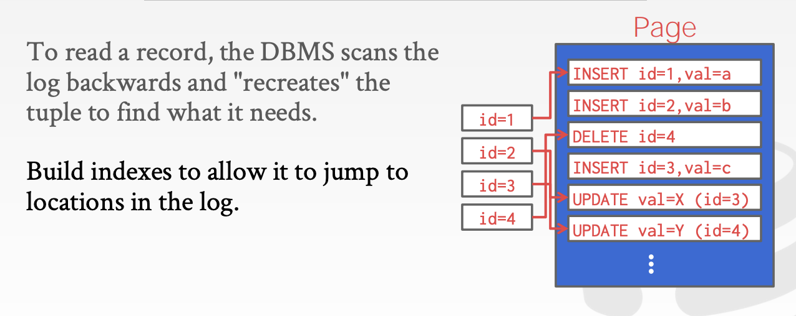
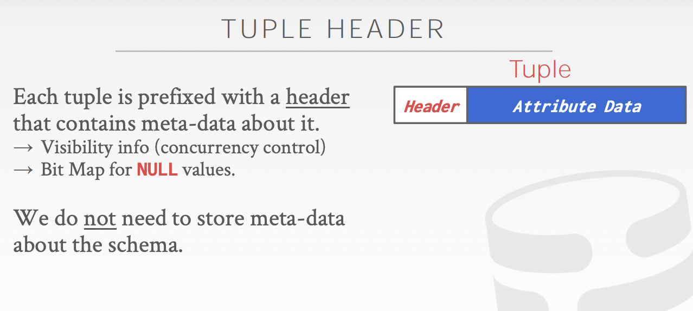
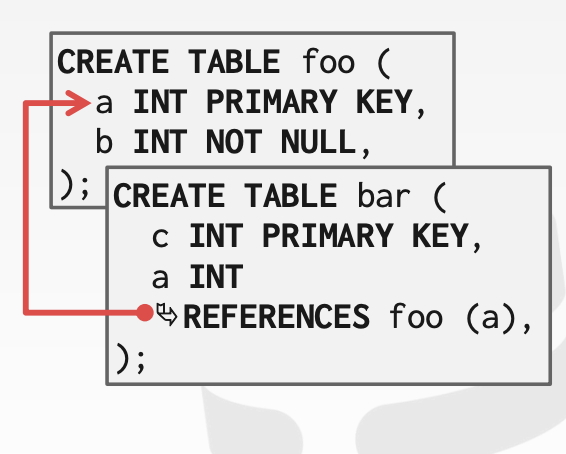
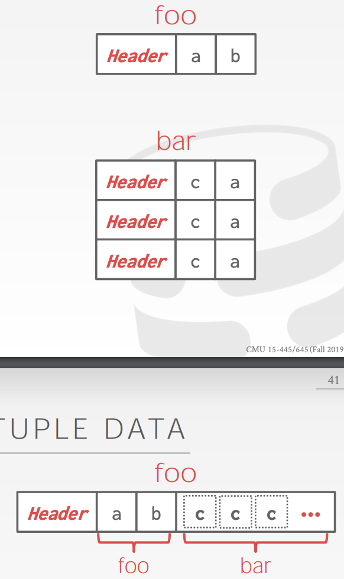

# How to use a software to manage Database

- Outline

  

- Storage

  - Volatile Memory(memory)
    - 断电丢失
    - 贵
    - 越接近cpu越快
    - 随机存取(byte)
  - Non-Volatile Memory(disk)
    - 断电不丢失
    - 便宜，SDD/HDD
    - 顺序存取(page/block addressable，要读取需要有4KBpage在内存中)

  L1缓存读取需要0.5s的，SDD需要1.7天，HDD需要16.5周

- Disk-Oriented DBMS
  - 数据是存储在Non-Volatile Memory上的，以页划分，第一页是director page
  - DBMS的**Buffer Pool**控制数据在Non-Volatile Memory和Volatile Memory上互相转换
    - 请求引擎传入需要的页地址，Buffer Pool将该页搬到内存中并返回指针

- Why not use OS?
  - 使用DBMS管理Buffer Pool是因为DBMS更了解自己的数据
  - OS的话如果用MMAP可能导致缺页，缓存不命中的话时间消耗很大
  - 多进程MMAP的话多个writer很复杂
  - DBMS可以比OS更好的管控缓存
    - 按更好的顺序写dirty page到磁盘
    - 专用的预读取
    - 缓存替换
    - 线程/进程调度

## Database Page

- a database page is a fixed-size block of data
  - contains **metadata，indexes，tuples，log records**
  - each page with a unique identifier
  - page size：512B-16KB之间，一般来说如果database page大于物理页(4KB)，DBMS需要保证在写page的时候system crash了的措施（SQLite Oracle 4KB，SQLserver，PostgreSQL 8KB，MySQL 16KB）

- Page 存储架构

  - Heap File Organization

    - Heap File是一堆无序的page的集合

      - 实现方式一：链表：header page维护一个空页链表和一个数据页链表；如果需要随机存取需要扫描全部链表

        

      - 实现方式二：页目录：特殊页面记录数据页的位置和每页上空余空间的数量

        

  - Sequential/Sorted File Organization

  - Hashing File Organization

- Page Layout:

  - header

    - Page Size
    - Checksum
    - DBMS Version
    - Transaction Visibility
    - Compression Information

  - Data的存储方式：

    1. slotted-pages（common in many DBMS）

       - header后存slot array, slot array中存每个tuple的starting location
       - slot array往后排，tuple往前排
       - slot array最后一个和tuple最后一个meet的时候一个page就存满了

       

    2. log-structured（fast write, slow read）

       - log从前往后写
       - 创建一个index指向相关最新的log条目
       - 查log条目的时候从后往前查
       - 定期压缩log条目

       

       

- Tuple layout

  - 一个Tuple前面有个header，记录Visibility Info(并发控制)和BitMap，属性如何解码靠DBMS

    

- Denormalized data

  - 一些相关的tuple会被提前存在同一个page上

    

## Data Representation

- Integer/Bigint/Smallint/Tinyint（C++表示）
- Numeric/Decimal （C++表示float/double是固定精度的，会有rounding error；numeric/decimal是不固定精度）
  - 不同的DBMS不同的实现
- Large Values
  - 一般的DBMS都不允许一条记录超过Page size
  - 为了存储记录中较大的数据，引入Overflow Page，较大的数据指向Overflow page，Overflow Page中存数据（不够的话指向Page链）
    - Postgresql：>2KB
    - MySQL/SQL server: >1/2 page size
  - 其他系统引入BLOB type（外部文件）来支持large value，DBMS不能控制外部文件（没有transaction protection，durability protection）

## System Catalog

- Database stores metadata in internal catalog
  - tables，columns，indexes，views
  - users，permissions
  - internal statistics
- 基本上所有的db都会把自己的catalog像table一样存储
  - catalog info as tuple
  - 需要special code to bootstrapping catalog

## Database Workload

- OLTP(简单的read/update eg：bank account)
  - Simple Write
- OLAP(复杂的queries，表合并，数据分析 eg：amazon wants to know Top 5 Popular products)
  - Complex Read
- Hybrid(混合)

## Storage Model

- NSM(N-array storage model)
  - ideal for **OLTP**
  - 一个tuple里面所有column都是连续排的
  - fast inserts，updates，adds
  - 不方便做集合
- DSM(Decomposition storage model)
  - ideal for **OLAP**
  - 一个page全是一种attributes(column store)
  - Tuple Identification
    - 固定长度
    - Embedd Tuple id
  - better query processing, slow updates, inserts,deletes
  - 现在几乎所有DB都是DM