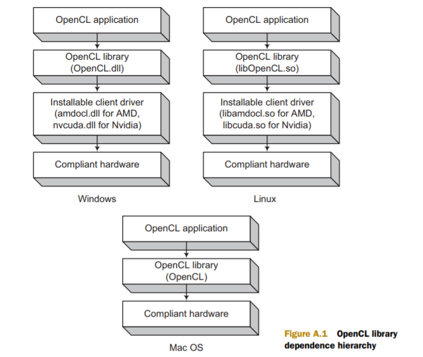
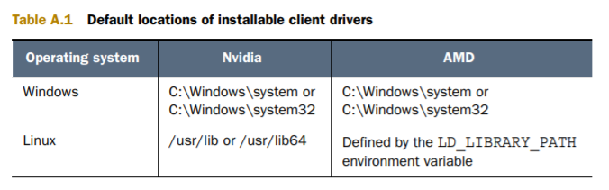

# introduction about SDK
## 概述
- 两个SDK最受欢迎：AMD APP SDK；Nvidia GPU computing SDK
- SDK版本取决于GPU版本型号厂商和操作系统，linux上通过`lspci`命令查看GPU版本型号
## 头文件和库文件
- OpenCL只需要一个头文件cl.h，linux和windows中`#include <CL/cl.h>`，mac中`#include <OpenCl/cl.h>`
- linux和windows中编译opencl application还需要库文件，由厂商提供
- linux和windows中application运行时自动去找扩展ICD(installable client driver)
- 流程：
- 库文件的位置：
## 具体安装流程
- 书附录A