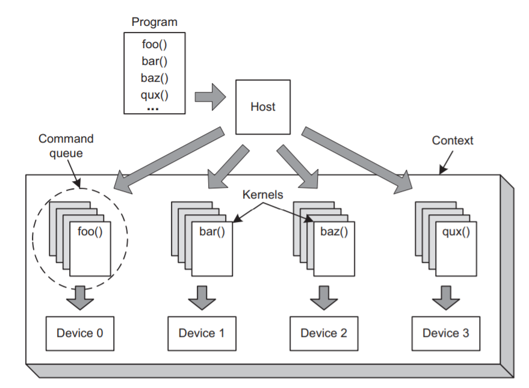

# OpenCL概述
## 背景
- GPU出现，需要一个统一的语言来对GPU，CPU进行编程（不同厂家生产的）
- 不同厂家生产的GPU架构不同，指令集不同，需要一个中间标准
- Apple(一个牛逼的甲方，选谁的处理器谁tremendous increase profit)提出建立一个统一的编程接口，乙方们联合写了OpenCL雏形
## 优势
- portability：
    - write once, run on anything. 
    - 一个可执行文件可以立即在多个异构的设备上面运行（怎么做到的？）
    - 传统C/C++在不同的设备上需要不同的编译器，连接器
- 标准化的向量运算：
    - 向量定义：一系列同数据类型的元素，当vector被操作时，每个元素在同一clock cycle里被操作
    - 现代处理器都能处理向量运算
    - 传统C/C++没有向量的数据结构定义，不同的处理器采用自己的方式(Intel:SSE;Nvidia:PTX...)
    - OpenCL中定义了向量，运行的时候不同厂家转为自己的指令集
- 并行计算：
    - 分配task到multiple computing elements，这些tasks叫做kernels
    - host：user development system
    - host application：一个运行在host上的程序，用于分配kernels到他们应该去的devices
    - context：host和其他devices通过context联系
    - program：program是一个装kernels的容器
    - command queue：host从program中取出kernel，将参数和kernel联系上，传给不同devide的command queue
    - 整体架构
    - task parallelism:openCL除了数据层面的并行，还提供task层面的并行，不同的device可以执行不同的task；优于其他只有data parallelism的并行
    - device内部通常不止一个computing element，所以device内部也有并行
## 核心流程
- 基本流程
    - identify platform
    - access device
    - create context
    - read program from file, build it as a program
    - create kernel
    - create buffers for input and output
    - associate arguments for kernels
    - create command queue for devices
    - enqueue command
    - get result
- 示例代码
    ```
    #define _CRT_SECURE_NO_WARNINGS
    #define PROGRAM_FILE "matvec.cl"
    #define KERNEL_FUNC "matvec_mult"

    #include <stdio.h>
    #include <stdlib.h>
    #include <sys/types.h>

    #ifdef MAC
    #include <OpenCL/cl.h>
    #else  
    #include <CL/cl.h>
    #endif

    int main() {

    /* Host/device data structures */
    cl_platform_id platform;
    cl_device_id device;
    cl_context context;
    cl_command_queue queue;
    cl_int i, err;

    /* Program/kernel data structures */
    cl_program program;
    FILE *program_handle;
    char *program_buffer, *program_log;
    size_t program_size, log_size;
    cl_kernel kernel;
    
    /* Data and buffers */
    float mat[16], vec[4], result[4];
    float correct[4] = {0.0f, 0.0f, 0.0f, 0.0f};
    cl_mem mat_buff, vec_buff, res_buff;
    size_t work_units_per_kernel;

    /* Initialize data to be processed by the kernel */
    for(i=0; i<16; i++) {
        mat[i] = i * 2.0f;
    } 
    for(i=0; i<4; i++) {
        vec[i] = i * 3.0f;
        correct[0] += mat[i]    * vec[i];
        correct[1] += mat[i+4]  * vec[i];
        correct[2] += mat[i+8]  * vec[i];
        correct[3] += mat[i+12] * vec[i];      
    }

    /* Identify a platform */
    err = clGetPlatformIDs(1, &platform, NULL);
    if(err < 0) {
        perror("Couldn't find any platforms");
        exit(1);
    }

    /* Access a device */
    err = clGetDeviceIDs(platform, CL_DEVICE_TYPE_GPU, 1, 
            &device, NULL);
    if(err < 0) {
        perror("Couldn't find any devices");
        exit(1);
    }

    /* Create the context */
    context = clCreateContext(NULL, 1, &device, NULL, 
            NULL, &err);
    if(err < 0) {
        perror("Couldn't create a context");
        exit(1);   
    }

    /* Read program file and place content into buffer */
    program_handle = fopen(PROGRAM_FILE, "r");
    if(program_handle == NULL) {
        perror("Couldn't find the program file");
        exit(1);   
    }
    fseek(program_handle, 0, SEEK_END);
    program_size = ftell(program_handle);
    rewind(program_handle);
    program_buffer = (char*)malloc(program_size + 1);
    program_buffer[program_size] = '\0';
    fread(program_buffer, sizeof(char), program_size, program_handle);
    fclose(program_handle);

    /* Create program from file */
    program = clCreateProgramWithSource(context, 1, 
        (const char**)&program_buffer, &program_size, &err);
    if(err < 0) {
        perror("Couldn't create the program");
        exit(1);   
    }
    free(program_buffer);

    /* Build program */
    err = clBuildProgram(program, 0, NULL, NULL, NULL, NULL);
    if(err < 0) {

        /* Find size of log and print to std output */
        clGetProgramBuildInfo(program, device, CL_PROGRAM_BUILD_LOG, 
                0, NULL, &log_size);
        program_log = (char*) malloc(log_size + 1);
        program_log[log_size] = '\0';
        clGetProgramBuildInfo(program, device, CL_PROGRAM_BUILD_LOG, 
                log_size + 1, program_log, NULL);
        printf("%s\n", program_log);
        free(program_log);
        exit(1);
    }

    /* Create kernel for the mat_vec_mult function */
    kernel = clCreateKernel(program, KERNEL_FUNC, &err);
    if(err < 0) {
        perror("Couldn't create the kernel");
        exit(1);   
    }

    /* Create CL buffers to hold input and output data */
    mat_buff = clCreateBuffer(context, CL_MEM_READ_ONLY | 
        CL_MEM_COPY_HOST_PTR, sizeof(float)*16, mat, &err);
    if(err < 0) {
        perror("Couldn't create a buffer object");
        exit(1);   
    }      
    vec_buff = clCreateBuffer(context, CL_MEM_READ_ONLY | 
        CL_MEM_COPY_HOST_PTR, sizeof(float)*4, vec, NULL);
    res_buff = clCreateBuffer(context, CL_MEM_WRITE_ONLY, 
        sizeof(float)*4, NULL, NULL);

    /* Create kernel arguments from the CL buffers */
    err = clSetKernelArg(kernel, 0, sizeof(cl_mem), &mat_buff);
    if(err < 0) {
        perror("Couldn't set the kernel argument");
        exit(1);   
    }         
    clSetKernelArg(kernel, 1, sizeof(cl_mem), &vec_buff);
    clSetKernelArg(kernel, 2, sizeof(cl_mem), &res_buff);

    /* Create a CL command queue for the device*/
    queue = clCreateCommandQueue(context, device, 0, &err);
    if(err < 0) {
        perror("Couldn't create the command queue");
        exit(1);   
    }

    /* Enqueue the command queue to the device */
    work_units_per_kernel = 4; /* 4 work-units per kernel */ 
    err = clEnqueueNDRangeKernel(queue, kernel, 1, NULL, &work_units_per_kernel, 
        NULL, 0, NULL, NULL);
    if(err < 0) {
        perror("Couldn't enqueue the kernel execution command");
        exit(1);   
    }

    /* Read the result */
    err = clEnqueueReadBuffer(queue, res_buff, CL_TRUE, 0, sizeof(float)*4, 
        result, 0, NULL, NULL);
    if(err < 0) {
        perror("Couldn't enqueue the read buffer command");
        exit(1);   
    }

    /* Test the result */
    if((result[0] == correct[0]) && (result[1] == correct[1])
        && (result[2] == correct[2]) && (result[3] == correct[3])) {
        printf("Matrix-vector multiplication successful.\n");
    }
    else {
        printf("Matrix-vector multiplication unsuccessful.\n");
    }

    /* Deallocate resources */
    clReleaseMemObject(mat_buff);
    clReleaseMemObject(vec_buff);
    clReleaseMemObject(res_buff);
    clReleaseKernel(kernel);
    clReleaseCommandQueue(queue);
    clReleaseProgram(program);
    clReleaseContext(context);

    return 0;
    }
    ```

- kernel code示例
    ```
    __kernel void matvec_mult(__global float4* matrix,
                          __global float4* vector,
                          __global float* result) {
    
    int i = get_global_id(0);
    result[i] = dot(matrix[i], vector[0]);
    }
    ```
- 编译和执行
    - 上述code需要在openCL compliant framework编译成opencl application才能使用
    - framework由vendor提供，一个framework由platform layer，runtime和compiler组成
    - platform layer：提供platform使之能够连接到device并构成context
    - runtime：使host application能够派发kernels到各个device的command queue
    - compiler：建立包含可执行的kernel的program    
## 标准和扩展
- 标准: OpenCL约束了一系列标准，只有满足了这些标准的vendor才能作为OpenCL compliant
- 扩展：在标准之外的特性加在扩展里，被OpenCL working group认同的扩展名称为cl_khr_\<name>，单个vendor提供没有被working group认可的扩展名称为cl_vendor_\<name>
