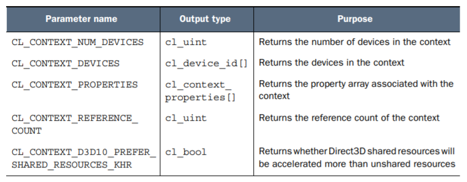

# Host Programming
## 元数据结构
- 不同的厂商存储数据的位数和方式不同，OpenCL需要一个统一的标准
- 元数据 in OpenCL
    ```
    cl_char         8b
    cl_uchar        8b
    cl_short        16b
    cl_ushort       16b
    cl_int          32b
    cl_uint         32b
    cl_long         64b
    cl_ulong        64b
    cl_half         16b     半精度浮点数
    cl_float        32b
    cl_double       64b
    ```
- 基本上上述元数据就是float或者int typedef的版本，所以int和float怎么操作，上述元数据就怎么操作
## Accessing Platform
### clGetPlatformIDs
- 搜索到的platform_id数量取决于安装的SDK数量，如果有两个厂商生产的device，安装了两个分别的SDK，会搜索到两个platform_id
- `cl_int clGetPlatformIDs(cl_uint num_entries,
 cl_platform_id *platforms, cl_uint *num_platforms)`
- num_entries为用户传入参数，代表用户想要传回的最大platform_id个数，该参数约束了platforms返回的长度
- 返回int代表成功与否，0为成功，负数为错误代码
- num_platforms为查找到的platform id个数，platforms放查找到的platform数据结构
- platforms参数可以被设置为NULL，这种情况下调用clGetPlatformIDs的作用是了解当前host机有几个platform
- 获取当前host机上每一个platform结构：
    ```
    cl_platform_id *platforms;
    cl_uint num_platforms;
    clGetPlatformIDs(5, NULL, &num_platforms);
    platforms = (cl_platform_id*)
    malloc(sizeof(cl_platform_id) * num_platforms);
    clGetPlatformIDs(num_platforms, platforms, NULL);
    ```

### clGetPlatformInfo
- 根据platform_id进一步获取platform信息：`cl_int clGetPlatformInfo(cl_platform_id platform,
 cl_platform_info param_name, size_t param_value_size,
 void *param_value, size_t *param_value_size_ret)`
- param_name为user想知道的信息类型，param_value_size为用于存储的buffer长度，param_value_size_ret为该信息实际长度
- 数据类型枚举值：
- clGetPlatformInfo的用处在于有时候application对于特定的extensions有要求
    ```
    #include <stdio.h>
    #include <stdlib.h>
    #include <string.h>

    #ifdef MAC
    #include <OpenCL/cl.h>
    #else
    #include <CL/cl.h>
    #endif

    int main() {

    /* Host data structures */
    cl_platform_id *platforms;
    cl_uint num_platforms;
    cl_int i, err, platform_index = -1;
    
    /* Extension data */
    char* ext_data;							
    size_t ext_size;   
    const char icd_ext[] = "cl_khr_icd";

    /* Find number of platforms */
    err = clGetPlatformIDs(1, NULL, &num_platforms);		
    if(err < 0) {		
        perror("Couldn't find any platforms.");			
        exit(1);							
    }									
    
    /* Access all installed platforms */
    platforms = (cl_platform_id*) 					
        malloc(sizeof(cl_platform_id) * num_platforms);		
    clGetPlatformIDs(num_platforms, platforms, NULL);		
    
    /* Find extensions of all platforms */
    for(i=0; i<num_platforms; i++) {
    
        /* Find size of extension data */
        err = clGetPlatformInfo(platforms[i], 			
            CL_PLATFORM_EXTENSIONS, 0, NULL, &ext_size);		
        if(err < 0) {
            perror("Couldn't read extension data.");			
            exit(1);
        }								

        /* Access extension data */   
        ext_data = (char*)malloc(ext_size);				
        clGetPlatformInfo(platforms[i], CL_PLATFORM_EXTENSIONS, 	
                ext_size, ext_data, NULL);				
        printf("Platform %d supports extensions: %s\n", i, ext_data);

        /* Look for ICD extension */   
        if(strstr(ext_data, icd_ext) != NULL) {
            free(ext_data);
            platform_index = i;
            break;
        }
        free(ext_data);
    }

    /* Display whether ICD extension is supported */
    if(platform_index > -1)
        printf("Platform %d supports the %s extension.\n", 
                platform_index, icd_ext);
    else
        printf("No platforms support the %s extension.\n", icd_ext);
        
    /* Deallocate resources */
    free(platforms);
    return 0;
    } 
    ```


## Accessing Devices
- 获取了platform id之后就能获取到和当前platform相关联的所有devices的信息
### clGetDeviceIDs
- `cl_int clGetDeviceIDs(cl_platform_id platform,
 cl_device_type device_type, cl_uint num_entries,
 cl_device_id *devices, cl_uint *num_devices)`
- device_type枚举值：
- 获取device数量：
    ```
    cl_uint num_devices;
    clGetDeviceIDs(plat, CL_DEVICE_TYPE_ACCELERATOR, 1, NULL, &num_devices);
    ```
### clGetDeviceInfo
- `cl_int clGetDeviceInfo(cl_device_id device,
 cl_device_info param_name, size_t param_value_size,
 void *param_value, size_t *param_value_size_ret)`
- 用法类似clGetPlatformInfo，但是device_info_type有50多种，且返回类型并不都是char[]

## Managing devices with context
- 一个context只能控制来自一个platform的devices
- host program可以创建多个context来控制多个platform的devices
### CreateContext
- 根据已知devices创建context：`cl_context clCreateContext(const cl_context_properties *properties,
 cl_uint num_devices, const cl_device_id *devices,
 (void CL_CALLBACK *notify_func)(...),
 void *user_data, cl_int *error)`
- 不access platform或者devices，通过device type创建context：`cl_context clCreateContextFromType(
 const cl_context_properties *properties,
 cl_device_type device_type,
 (void CL_CALLBACK *notify_func)(...),
 void *user_data, cl_int *error)`
- 跟之前的函数不一样的是创建context函数直接返回contetx变量，不需要user在host program中管理变量地址的申请和释放
- cl_context_properties是user传入函数的，标记了该context的一些属性，注意最后一个元素必须是0
    ```
    cl_context_properties context_props[] = {
    CL_CONTEXT_PLATFORM, (cl_context_properties)platforms[0],
    CL_GL_CONTEXT_KHR, (cl_context_properties)glXGetCurrentContext(),
    CL_GLX_DISPLAY_KHR, (cl_context_properties)glXGetCurrentDisplay(),
    0};
    ```
- properties枚举值：
- user_data就是用户传入的数据，可以是任意类型的，一般用于错误处理或者其他的数据，不用跟properties参数一样必须以0结尾
- call back函数用于处理context执行错误的情况
- err用来存储错误代码返回，0代表运行成功
### clGetContextInfo
- `clGetContextInfo(cl_context context, cl_context_info param_name,
 size_t param_value_size, void* param_value,
 size_t *param_value_size_ret)`
- properties枚举值：
### reference count
- 由于context创建过程是通过函数返回context对象，如果context是一个局部变量，那么它将会在程序结束后自动释放
- 但有的时候第三方库并不希望context被释放
- context维护一个reference count，只有当这个reference count减为0的时候context才会被释放
- clRetainContext增加reference count；clReleaseContext减少reference count
- 需要调用一个已经存在的context时，需先clRetainContext，在业务代码结束后clReleaseContext
- 创建一个新Context需要在业务代码结束后clReleaseContext
- 一个valid context在openCL里是一个必要前提，只有存在valid context才能创建program，只有存在program才能向device分发kernels
## storing device code in programs
### create programs
- `clCreateProgramWithSource(cl_context context, cl_uint src_num,
 const char **src_strings, const size_t *src_sizes,
 cl_int *err_code)`
- 不接受file pointer或者file descriptor，需要先把file里面的内容读到buffer里
    ```
    program_handle = fopen("kernel.cl", "r");
    fseek(program_handle, 0, SEEK_END);
    program_size = ftell(program_handle);
    rewind(program_handle);
    program_buffer = (char*)malloc(program_size+1);
    program_buffer[program_size] = '\0';
    fread(program_buffer, sizeof(char),
    program_size, program_handle);
    fclose(program_handle);
    program = clCreateProgramWithSource(context, 1,
    (const char**)program_buffer, program_size, &err);
    ```
- `clCreateProgramWithBinary(cl_context context,
 cl_uint num_devices, const cl_device_id *devices,
 const size_t *bin_sizes, const unsigned char **bins,
 cl_int *bin_status, cl_int *err_code)`
- createProgramWithBinary从二进制文件中读取有关program的信息并且需要额外的device相关信息
### build programs
- OpenCL对编译器没有标准约束，各个platform的编译器由vendor决定，诸如Nvidia的编译器其实就是个解释器，只有在runtime才能进行编译
- 但是所有的编译器必须对clBuildProgram进行响应
- `clBuildProgram(cl_program program, cl_uint num_devices,
 const cl_device_id *devices, const char *options,
 (void CL_CALLBACK *notify_func)(...), void *user_data)`
- clBuildProgram将device和program attach起来，将device写入program相关信息
### get program info
- `clGetProgramInfo(cl_program program, cl_program_info param_name,
 size_t param_value_size, void *param_value,
 size_t *param_value_size_ret)`
- get program info提供一些跟数据结构有关的信息，比如和此program有联系的context，target devices等
- `clGetProgramBuildInfo(cl_program program,
 cl_device_id device,
 cl_program_build_info param_name,
 size_t param_value_size, void *param_value,
 size_t *param_value_size_ret)`
- get program build info提供一些跟program build相关的信息，是唯一能获取到program build时出了什么问题的途径
- 信息类型：
- 获取log示例代码
    ```
    err = clBuildProgram(program, 1, &device, options, NULL, NULL);
    if(err < 0) {
    clGetProgramBuildInfo(program, device, CL_PROGRAM_BUILD_LOG,
    0, NULL, &log_size);
    program_log = (char*) calloc(log_size+1, sizeof(char));
    clGetProgramBuildInfo(program, device, CL_PROGRAM_BUILD_LOG,
    log_size+1, program_log, NULL);
    printf("%s\n", program_log);
    free(program_log);
    }
    ```
## kernels
### creating kernels
- `clCreateKernelsInProgram(cl_program program, cl_uint num_kernels,
cl_kernel *kernels, cl_uint *num_kernels_ret);`创建当前program中定义的所有kernels
- `clCreateKernel(cl_program program, const char *kernel_name, cl_int *error)` 已知函数名，创建对应单个kernel
### get kernel info
- `clGetKernelInfo(cl_kernel kernel, cl_kernel_info param_name,
size_t param_value_size, void *param_value,
size_t *param_value_size_ret)`
- kernel也是通过reference counter属性来获取和释放的，使用后要调用releaseKernel
## collect kernels in command queues
- command queue是和device联系在一起的
### create command queues
- `clCreateCommandQueue(cl_context context, cl_device_id device,
cl_command_queue_properties properties, cl_int *err)` 创建commandqueue需要device，context
### enqueue kernels
- `clEnqueueTask(cl_command_queue queue, cl_kernel kernel,
cl_uint num_events, const cl_event *wait_list, cl_event *event)` enqueue kernels，因为command queue是和device绑定的，所以把kernel分配给哪个command queue，自然也确定了它的device


