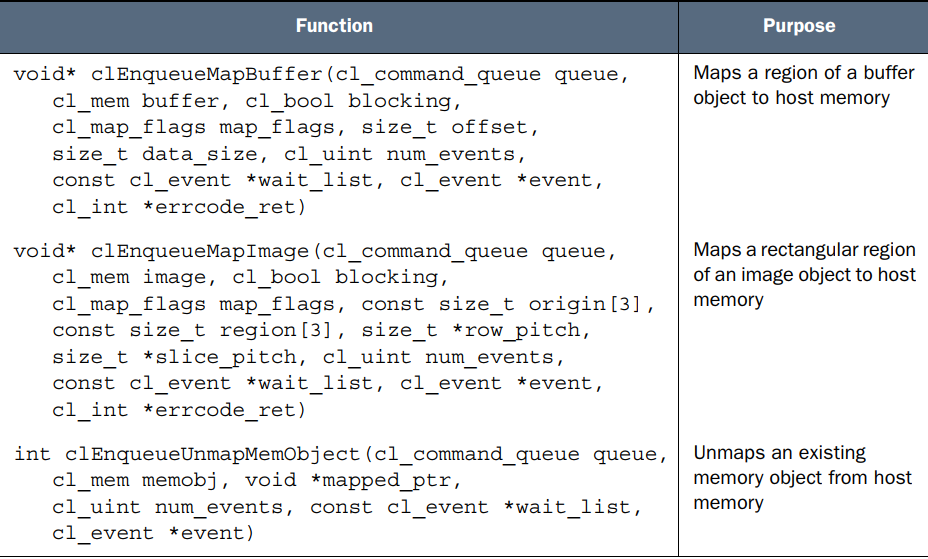

# 创建kernel argus
- 因为devices在不同的处理器上，所以为kernel传参比传统c++输入参数更复杂
- `clSetKernelArg (cl_kernel kernel, cl_uint index, size_t size,
const void *value)`
    - index： 第几个argu
    - value： 指向数据的指针，四种类型 
    - value中第二种类型是为大型数据设计(数组向量图片等)：非图片->buffer object,图片->image object
## buffer object
- `clCreateBuffer(cl_context context, cl_mem_flags options, size_t size,
void *host_ptr, cl_int *error)`
    - host_ptr:指向原始数据
    - options：
    - 前三种option标记的是device access data的权限
    - 后三种option标记的是host机上mem具体怎么存储
    - returns cl_mem object
- 后三种option详细解释：
    - CL_MEM_USE_HOST_PTR: 直接采用host_ptr指向的区域作为输入数据buffer，但是在分配kernel的过程中该区域需要保证不能改动，常常引起错误
    - CL_MEM_COPY_HOST_PTR：拷贝host_ptr的数据到重新分配的buffer中
    - CL_MEM_ALLOC_HOST_PTR: 和CL_MEM_COPY_HOST_PTR搭配使用，分配的新buffer是一个pinned memory，不会被操作系统扇出
    - NULL，如果该argument只是用来存放kernel输出的数据，那么只需要host分配相应空间，不用定义初始数据
## subbuffer object
- 有些时候kernels会需要另一个kernel argu的一部分作为argu，需要像从string中建立substring一样创建subbuffer
- `clCreateSubBuffer(cl_mem buffer,
cl_mem_flags flags, cl_buffer_create_type type,
const void *info, cl_int *error)`
    - flags：即上面说的options
    - type：CL_BUFFER_CREATE_TYPE_REGION
    - info：指向一个_cl_buffer_region结构
    ```
    typedef struct _cl_buffer_region {
        size_t origin;  // the start of the subbuffer data
        size_t size;    // subbuffer size
    } cl_buffer_region;
    ```
## Image object
```
clCreateImage2D (cl_context context, cl_mem_flags opts,
const cl_image_format *format, size_t width, size_t height,
size_t row_pitch, void *data, cl_int *error)

clCreateImage3D (cl_context context, cl_mem_flags opts,
const cl_image_format *format, size_t width, size_t height,
size_t depth, size_t row_pitch, size_t slice_pitch,
void *data, cl_int *error)
```
# memory object transfer command
## Read/write data transfer
- 之前的clSetKernelArg其实就是一个Read/Write data transfer command
- 除了设置kernelArg之外，还有六种此类型的指令 
- blocking: CL_TRUE:同步，host等待操作结束
            CL_FALSE:异步，发送指令并不等待
## Mapping Memory Objects
- 类似C/C++将文件的内容映射到内存中来提高处理效率，建立一个映射将device上的memory映射到host上
- 三个指令：
- 前两个指令返回void*，指向map后的host上的区域，unmap时将这个参数传给第三个函数
- map_flags约束host上这块map区域的access权限：CL_MAP_READ，CL_MAP_WRITE，CL_MAP_READ|CL_MAP_WRITE
## Copying data between memory objects
- 
# Data Partitioning
- 上一部分的数据多是host到device之间划分，但是OpenCL中device是由多个computing element组成的，因此可以进一步划分数据
- `clEnqueueNDRangeKernel(cl_command_queue queue, cl_kernel kernel,
cl_uint work_dims, const size_t *global_work_offset,
const size_t *global_work_size, const size_t *local_work_size,
cl_uint num_events, const cl_event *wait_list, cl_event *event)`
- clEnqueueNDRangeKernel函数做的工作同clEnqueueTask即将一个kernel分配给command queue，但是它允许用户进一步划分数据
    - work_dims: 数据维度数
    - global_work_offsets: 每个维度的global ID offset
    - global_work_size: 每个维度的work item数
    - local_work_size: 每个维度在一个work group中的work item数
# 关于work item，work group
```
for(i=0; i<Z; i++) {
    for(j=0; j<Y; j++) {
        for(k=0; k<X; k++) {
            process(point[i][j][k]);
        }
    }
}
```
- loop这样的运算非常的低效，特别是对于GPU来说，因为GPU不适合做比较运算和分支跳转
- kernel中的运算不用包含loop，而是只包含基本的一次运算，如上述代码中的process函数，这样的一个单个kernel叫做work-item
- 比较：
    - kernel：一系列操作 `process(point[i][j][k])`
    - work-item：在特定数据上的单个运算 `process(point[1][2][3])`
- 特定的{i,j,k}序列就是work-item的global id，它唯一标记了一个work-item以及它应该接触到的data
- global id中的数据数量也就是维度，work dims，在这里是3
- minimum work dims=1，maximum dims取决于devices，通过调用clGetDeviceInfo查询CL_DEVICE_MAX_WORK_ITEM_DIMENSIONS获得
