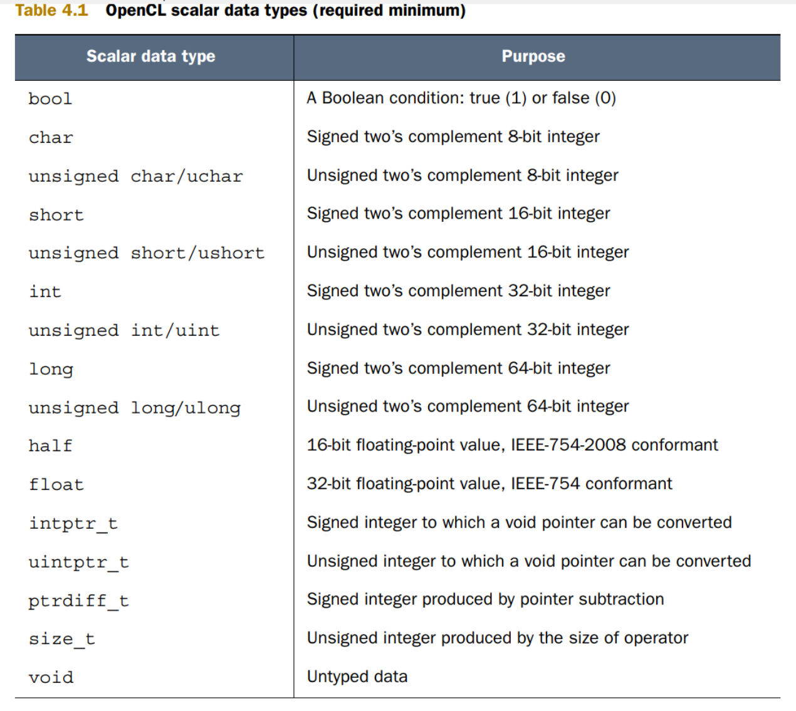
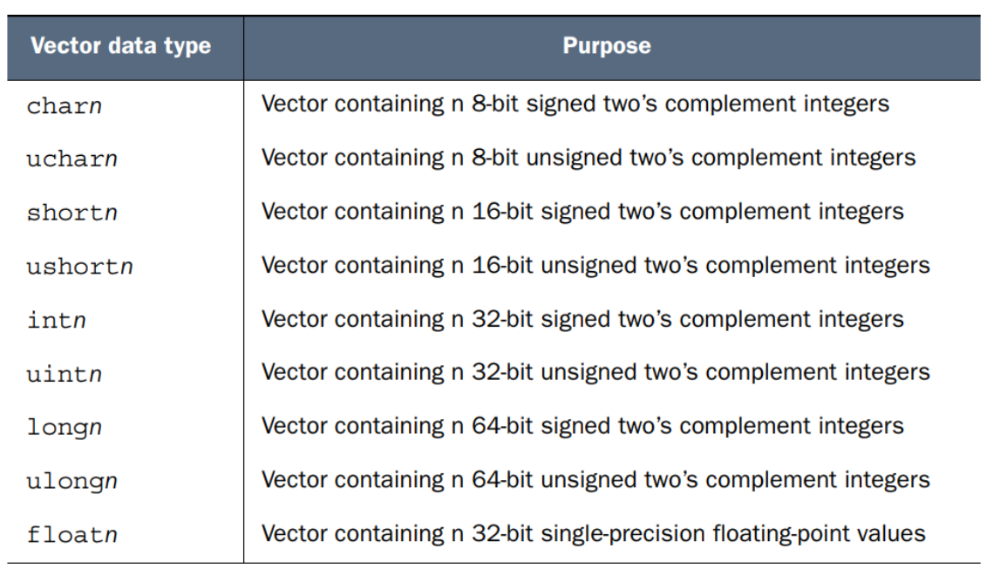
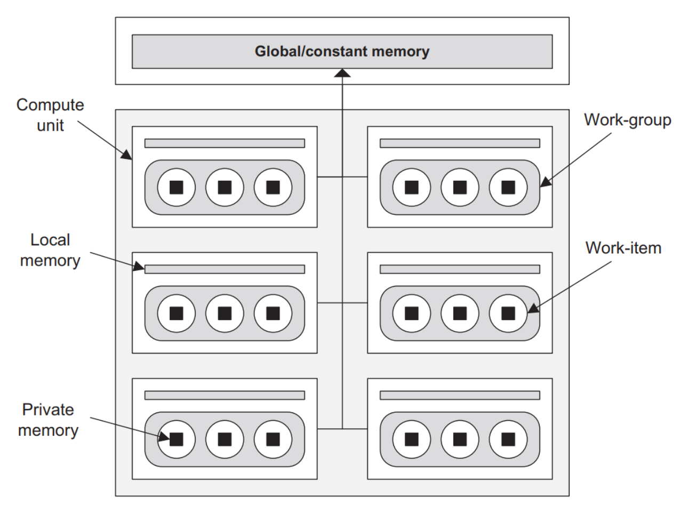

# kernel program
- 每一个kernel func必须以`__kernel`开头
- 每一个kernel func必须返回void
- 有些platform不执行不带参数的kernel
- kernel的参数有两种传递方式：传值和传引用
    - 传值只能传基本类型，不能传复杂类型
    - 传引用就是传一个指向特定内存的指针
    - 每个传引用的参数前必须有一个地址限定符
        - __global
        - __constant
        - __local
        - __private
# scalar data type

- 上述scalar_type不包含double，这是因为不一定所有device都支持双精度的浮点数
- 一个wise的策略就是在host application中调用`clGetDeviceInfo`并搜索extensions参数，如果device支持双精度，会在返回中显示同时将`-DFP_64`设置到`clBuildProgram`，这样kernel在调用的时候就可以使用`#if FP_64`来判断是否支持double
- kernel的编程如下：
```
#ifdef FP_64
#pragma OPENCL EXTENSION cl_khr_fp64: enable
#endif
__kernel void double_test(__global float* a,__global float* b, __global float* out) {
#ifdef FP_64
    double c = (double)(*a / *b);
    *out = (float)c;
#else
    *out = *a * *b;
#endif
}
```
# 大小端
- big-endian：低地址存放高位 powerPC架构
- little-endian：低地址存放低位 x86架构
- `clGetDeviceInfo`传`CL_DEVICE_ENDIAN_LITTLE`参数，kernel中可以用`#ifdef __ENDIAN_LITTLE__`
# vector data type
- vector类型有两个特别点：
    - 一个声明了类型的vector只能含有特定个数的元素
    - vector中的所有元素在同一时间被操作
- 
- 除了上述的vector type，部分devices还支持doublen和halfn
- OpenCL支持上述的n范围：2，3，4，8，16（但是并不是所有devices都能支持任何n）
- preferred vector size：
    - 调用`clGetDeviceInfo`传入参数`CL_DEVICE_PREFERRED_VECTOR_WIDTH_<TypeName>`,返回`cl_uint`
    - TypeName可以取CHAR，SHORT，INT，LONG，FLOAT甚至HALF和DOUBLE（如果不支持HALF和DOUBLE，会返回0）
- initializing vector
    - `float4 data_vec = (float4)(1.0, 1.0, 1.0, 1.0);`
    - `float4 data_vec = (float4)(1.0) // have the same value`
    - using another vector
    ```
    float2 a_vector = (float2)(1.0, 1.0);
    float2 b_vector = (float2)(2.0, 2.0);
    float4 c_vector = (float4)(a_vector, b_vector);
    ```
    - combination of scalar and vector
    ```
    float3 rgb = (float3)(0.25, 0.5, 0.75);
    float4 rgba = (float4)(rgb, 1.0);
    ```
- reading and modifying vector components
    - number index: 
    ```
    char16 msg;
    char a = msg.s0;    //msg.s0代表msg的第0个元素
    char b = msg.sC;    //msg.sC代表msg的第13个元素
    
    // index slices 或者 random序列（还可以重复index）
    char8 e = msg.s01234567;
    char4 f = msg.s5431;
    char8 g = (char8)(msg.s0ABB,msg.sE9,msg.sE9);

    // modification
    msg.s5 = 'O';
    msg.sB986 = (char4)('c','C','n','P');
    ```
    - letter index
    ```
    char4 a = (char4)('a','c',',','.');
    // N-size的向量可以用任意N个连续的字母来index
    char bx = a.x;
    char by = a.y;
    char bz = a.z;
    char bw = a.w;
    ```
    - hi,lo,even,odd
        - .hi: 高位那一半向量
        - .low: 低位那一半向量
        - .even: 偶数位向量
        - .odd: 奇数位向量
        - 如果向量尺寸为偶数，.hi和.low对半分
        - 如果向量尺寸为奇数，中位数包含在.low里
- 向量数据类型和大小端
    - 如果通过上述的index来获取向量中的元素，则大小端没有影响
    - 如果通过内存操作，比如用uint4来给uchar16赋值
    ```
    uint4 vec = (global uint4)(0x00010203, 0x04050607, 0x08090A0B, 0x0C0D0E0F);
    uchar *p = &vec;
    *test = (uchar16)(*p, *(p+1), *(p+2), *(p+3), *(p+4), *(p+5), *(p+6), *(p+7), *(p+8), *(p+9), *(p+10), *(p+11), *(p+12),
    *(p+13), *(p+14), *(p+15));
    ```
# OpenCL device model
- 
    - compute unit: 就像一个class room，有一个班级黑板（local memory），每次一个work_group可以在自己班级的黑板上坐运算
    - work_group: 就像一个class，包括一定数量的work_item，做完一次运算一个work_group就可以离开了，下一个work_group入住当前compute_unit
    - Global/constant_memory: 就像一个学校的总黑板，每一个work_item来总黑板上读取要计算的数据参数，计算完毕之后来黑板上写上结果（读写效率远小于local_memory）
    - 一个device多个compute_unit
- memory类型：
    - global memory：存储整个device都可以读取写入的数据（读写效率低）
    - constant memory：类似于global memory但是只读
    - local memory：存储work_item和work_group对应的数据
    - private memory: 存储单个work_item私有的数据
    - 大部分device不单独提供constant memory区，而是和global memory合并在一起；部分device会提供constant memory区
    - 当host传递一个buffer到device，这些buffer会被存储在global memory
- 地址空间限定符：
    - __local: 
        - 如果数据是要在work_group中share的，但是并不开放给全部的work group，就使用__local限定符
        - 一旦work_group开始进行处理，数据就会分配到相应内存
        - work_group计算完毕该部分内存释放
        - __local可以修饰kernel的参数和内部变量
        - 当__local修饰内部变量时，内部变量不能被直接初始化赋值
        ```
        __local float x = 4.0;  //不行

        __local float x;
        x = 4.0;                //可以
        ```
    - __private: 如果一个变量或者指针前没有存储空间限定符，则默认这个变量存储或指向private memory
- 非global限定的kernel参数：
    - __local arg:
        - host不能读写device的local memory，所以如果host采用clSetKernelArg来传入指向一块内存的参数，在device上这个参数一定是放在global/constant memory的
        - 如果要设置local arg，host只能分配空间：
        ```
        // 将最后一个参数value设置为NULL
        clSetKernelArg(kernel, 0, 16*sizeof(float), NULL);
        // 在kernel里就可以把第0号参数设置为长16个float的local参数
        __kernel void proc_data(__local float* nums, ...) {
        ...
        }
        ```
        - 综上所述，host不能赋初值给local arg
    - __private arg:
        - 不同于local arg，host application可以对private arg赋初值
        ```
        int num_iterations = 4;
        clSetKernelArg(kernel, 0, sizeof(num_iterations), &num_iterations);
        ```
        - 最后一个参数value需要是指向元数据类型的指针，该指针从host传到device使用的是传引用，但是kernel获取到arg使用的是传值，所以host并不能读取修改后的数据（在device上的）
        - 指向元数据类型并不代表一定要是标量数据
        ```
        float nums[4] = {0.0f, 1.0f, 2.0f, 3.0f};
        clSetKernelArg(kernel, 0, sizeof(nums), nums);
        ```
        - 注意，上述的set参数并不代表传了一个float array，因为kernel的参数是float4，是一个向量元素，所以和标量元数据类型参数的处理是一样的


