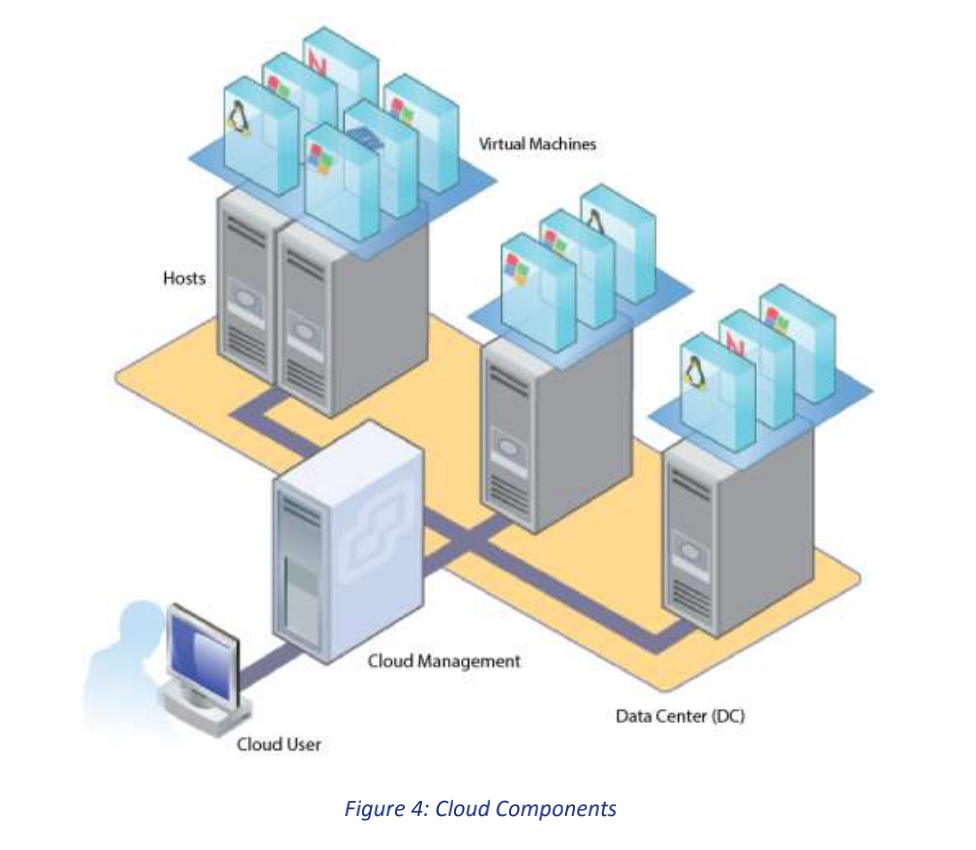

# CloudSim3.0.3

## 简介

- CloudSim是一款云计算仿真软件
- CloudSim第一层User Code存储对云环境的定义，例如：VM的数量，User的数量，调度策略选择，数据中心的位置
- CloudSim第二层提供了基于云的环境，用来模拟网络。用户可以在这一层定义带宽，内存，service的CPU
- CloudSim第三层是仿真引擎，用来运行组件的运行，沟通等事件


- 竞品：
  - cloudReports（更简单更注重资源和性能的模拟，方便配置）	
  - cloudAnalyst（**在VM Migration和响应时间上模拟上优于cloudsim**）

## Packages

- org.cloudbus.cloudsim
  - 用户可以写自己的scheduler来决定VM资源的划分
  - 用户可以写自己的cloudlet类
  - 两种资源划分的方式：
    - Space-Shared：一个cloudlet在一个VM上执行的时候，另一个cloudlet等待；执行结束并释放资源之后，另一个cloudlet可以运行在VM上
    - Time-Shared：CPU可以在VM间动态分配资源，如果两个cloudlet并行运行，每一个得到一半的资源
- org.cloudbus.cloudsim.core/org.cloudbus.cloudsim.core.predicates
  - 仿真事件，predicates用来从deferred queue中选取事件
- org.cloudbus.cloudsim.distributions
  - 数学概率分布函数
- org.cloudbus.cloudsim.examples
  - just examples...
- org.cloudbus.cloudsim.lists
  - 组件：cloudlet，VM，hosts，PeS（？？）
  - 以及可以在组建上执行的一些操作，比如排序，查找等等
- org.cloudbus.cloudsim.network
  - network-based simulation
- org.cloudbus.cloudsim.power
  - Power-aware Data Center policies
- org.cloudbus.cloudsim.provisioners
  - 运行在一个host上的VM得到的资源：带宽，MIPS，内存等
- org.cloudbus.cloudsim.util
  - 数学函数
- Workload.planetlab.20110303
  - 仿真数据集的包，包含了PlanetLab VM workload trace

## 创建简单云组件示例

- 云环境四个必要组件：Cloudlet(User Request/jobs)，VM，Data Center，Broker(?)



- 用户发送Cloudlets，通过cloud Management来分发这些cloudlets并且分配资源到Data Center，Data Center里有多个host机，host上有一到多个VM

1. 初始化CloudSim包和库

   ```java
   static void main(){
     //1. Initialize the CloudSim package(should be done before creating any entities)
     
     // number of users, also number of brokers
     int num_user = 1;
     
     // Get current time zone and the simulation start time
     Calendar calendar = Calendar.getInstance();
     
     // whether to trace the simulation event
     boolean trace_flag = false;
     
     CloudSim.init(num_user, calendar, trace_flag)
   }
   ```

   

2. 创建Data Center

   ```java
   private static Datacenter createDatacenter(String name){
     //1. a list to store hosts
     List<Host> hostList = new ArrayList<Host>();
     
     //2. a host contains one or more PEs or CPUs/Cores
     List<Pe> peList = new ArrayList<Pe>();
     
     // 3. create PEs and add these into a list
     int mips=1000;
     // 0 is the PE id, second argument is the mips rating
     peList.add(new Pe(0, new PeProvisionerSimple(mips)));
     
     //4. create host with its id and list of PEs, add them to the list of machines
     int hostId = 0;
     int ram = 2048; // 2048MB
     long storage=1000000;	
     int bw = 10000;	// bandwidth
     hostList.add(
     			new Host(
           		hostId,
             	new RamProvisionerSimple(ram),
             	new BwProvisionerSimple(bw),
             	storage,
             	peList,
             	new VmSchedulerTimeShared(peList)
           )
     );
     
     //5. create a DatacenterCharacteristics object that stores the properties of a data center: architecture, OS, list of hosts, allocation policy:time- or space-shared, time zone and its price
     String arch = "x86";
     String os = "Linux";
     String vmm = "Xen";	// VM hypervisor
     double time_zone = 10.0;
     double cost = 3.0;	// the cost of using processing
     double costPerMem = 0.05;	// the cost of using memory
     double costPerStorage = 0.001;	// the cost of using storage
     double costPerBW = 0.0;	// the cost of using bw
     LinkedList<Storage> storageList = new LinkedList<Storage>();
     DatacenterCharacteristics characteristics = new DatacenterCharacteristics(arch,os,vmm,hostList,time_zone,cost,costPerMem,costPerStorage,CostPerBw);
     
     //6. create a PowerDatacenter object
     Datacenter datacenter = null;
     try{
       datacenter = new Datacenter(name, characteristics, new VmAllocationPolicySimple(hostList), storageList, 0);
     }catch(Exception e){
       e.printStackTrace();
     }
     return datacenter;
   }
   ```

   

3. 创建Data Center broker

   - broker是一个在cloud user和Data Center(Cloud Service Providers)之间的中间人，它负责把用户的请求路由到最合适的数据中心

   ```java
   private static DatacenterBroker createBroker(){
     DatacenterBroker broker = null;
     try{
       broker = new DatacenterBroker("Broker");
     }catch(Exception e){
       e.printStackTrace();
       return null;
     }
     return broker;
   }
   ```

4. 创建VM

   ```java
   vmlist = new ArrayList<Vm>();
   
   //VM description
   int vmid = 0;
   int mips = 250;
   long size = 10000;	//image size(MB)
   int ram = 512;			//vm memroy(MB)
   long bw = 1000;
   int pesNumber = 1;	//number of cpus
   String vmm = "Xen";	//VMM name
   
   // create two VMs
   // need to input brokerId
   Vm vm1 = new Vm(vmid, brokerId, mips, pesNumber, ram, bw, size, vmm, new CloudletSchedulerTimeShared());
   
   vmlist.add(vm1);
   
   broker.submitVmList(vmlist);
   ```

5. 创建Cloudlet

   - Cloudlet就是user提交的requests或者jobs

   ```java
   cloudletList = new ArrayList<Cloudlet>();
   
   //Cloudlet properties
   int id = 0;
   pesNumber = 1;
   long length = 250000;
   long fileSize = 300;
   long outputSize = 300;
   UtilizationModel utilizationModel = new UtilizationModelFull();
   Cloudlet cloudlet1 = new Cloudlet(id,length,pesNumber,fileSize,outputSize,utilizationModel,utilizationModel,utilizationModel);
   
   // attach cloudlet to specific user
   cloudlet1.setUserId(brokerId);
   
   cloudletList.add(cloudlet1);
   
   // submit cloudlet list to the broker
   broker.submitCloudletList(cloudletList);
   ```

6. 绑定Cloudlet到VM

   ```java
   // bind the cloudlets to the vms
   // then ths broker will submit the bound cloudlets only to the specific VM
   broker.bindCloudletToVm(cloudlet1.getCloudletId(),vm1.getId());
   ```

## 通过CloudSim创建一个数据集

CloudSimExample1.java改编

```java
package org.cloudbus.cloudsim.examples;
import java.io.File;
import java.io.FileWriter;
import java.io.IOException;
import java.io.PrintWriter;
import java.text.DecimalFormat;
import java.util.ArrayList;
import java.util.Calendar;
import java.util.LinkedList;
import java.util.List;
import java.util.Random;
import org.cloudbus.cloudsim.Cloudlet;
import org.cloudbus.cloudsim.CloudletSchedulerTimeShared;
import org.cloudbus.cloudsim.Datacenter;
import org.cloudbus.cloudsim.DatacenterBroker;
import org.cloudbus.cloudsim.DatacenterCharacteristics;
import org.cloudbus.cloudsim.Host;
import org.cloudbus.cloudsim.Log;
import org.cloudbus.cloudsim.Pe;
import org.cloudbus.cloudsim.Storage;
import org.cloudbus.cloudsim.UtilizationModel;
import org.cloudbus.cloudsim.UtilizationModelFull;
import org.cloudbus.cloudsim.Vm;
import org.cloudbus.cloudsim.VmAllocationPolicySimple;
import org.cloudbus.cloudsim.VmSchedulerTimeShared;
import org.cloudbus.cloudsim.core.CloudSim;
import org.cloudbus.cloudsim.provisioners.BwProvisionerSimple;
import org.cloudbus.cloudsim.provisioners.PeProvisionerSimple;
import org.cloudbus.cloudsim.provisioners.RamProvisionerSimple;
/**
* A simple example showing how to create a datacenter with one host and run
one cloudlet on it.
*/
public class writeresults {
	/** The cloudlet list. */
	private static List<Cloudlet> cloudletList;
	/** The vmlist. */
	private static List<Vm> vmlist;
	//the first and second rows in excel consists of 7 columns.
	private static final double[] Row1 = new double[7];
	private static final double[] Row2 = new double[7];
	/**
	* Creates main() to run this example.
	** @param args the args
	*/
	@SuppressWarnings("unused")
	public static void main(String[] args) {
		Log.printLine("Starting CloudSimExample1...");
		// Create file (example .txt or .csv)
		try {
			//automatically the file is created in the project folder
			File file = new File("Output2.csv");
			if (file.createNewFile()) {
				Log.printLine("File created: " + file.getName() + "\n");
			} else {
				Log.printLine("Deleting/overwritting file...\n");
				file.delete();
			}
    } catch (IOException e) { 
      System.out.println("An error occurred.");
		}
		try {
			int num_user = 1; // number of cloud users
			Calendar calendar = Calendar.getInstance();
			boolean trace_flag = false; // mean trace events
			// Initialize the CloudSim library
			CloudSim.init(num_user, calendar, trace_flag);
      
			// Second step: Create Datacenters
      Datacenter datacenter0 = createDatacenter("Datacenter_0");

      // Third step: Create Broker
			DatacenterBroker broker = createBroker();
			int brokerId = broker.getId();

      // Fourth step: Create one virtual machine
			vmlist = new ArrayList<>();
			// VM description
      int vmid = 0;
      int mips = 1000;
      long size = 10000; // image size (MB)
      int ram = 512; // vm memory (MB)
      long bw = 1000;
      int pesNumber = 1; // number of cpus
      String vmm = "Xen"; // VMM name
      // create VM
      Vm vm = new Vm(vmid, brokerId, mips, pesNumber, ram, bw, size,
      vmm, new CloudletSchedulerTimeShared());
      // add the VM to the vmList
      vmlist.add(vm);
      // submit vm list to the broker
      broker.submitVmList(vmlist);

      // Fifth step: Create one Cloudlet
			cloudletList = new ArrayList<>();
			Random rnd = new Random();
      // Cloudlet properties
      int id = 0;
      long length1 = rnd.nextInt(400000);
      long length2 = rnd.nextInt(400000);
      long fileSize = 300;
      long outputSize = 300;
      UtilizationModel utilizationModel = new UtilizationModelFull();
      Cloudlet cloudlet1 = new Cloudlet(id, length1, pesNumber, fileS
      ize, outputSize, utilizationModel, utilizationModel, utilizatio
      nModel);
      cloudlet1.setUserId(brokerId);
      cloudlet1.setVmId(vmid);
      id++;
      Cloudlet cloudlet2 = new Cloudlet(id, length2, pesNumber, fileS
      ize, outputSize, utilizationModel, utilizationModel, utilizatio
      nModel);
      cloudlet2.setUserId(brokerId);
      cloudlet2.setVmId(vmid);
      
      //row 1 column 1 and 2
      Row1[0] = 0;
      Row1[1] = length1;
      //row 2 column 1 and 2
      Row2[0] = 1;
      Row2[1] = length2;
      
      // add the cloudlet to the list
      cloudletList.add(cloudlet1);
      cloudletList.add(cloudlet2);
      
			// submit cloudlet list to the broker
      broker.submitCloudletList(cloudletList);
      
      // Sixth step: Starts the simulation
      CloudSim.startSimulation();
      CloudSim.stopSimulation();
      
      //Final step: Print results when simulation is over
      List<Cloudlet> newList = broker.getCloudletReceivedList();
      printCloudletList(newList);
      Log.printLine("CloudSimExample1 finished!");
  	} catch (NullPointerException e) {
      Log.printLine("Unwanted errors happen");
		}
	}
  /**
  * Creates the datacenter.
  ** @param name the name
  ** @return the datacenter
  */
  private static Datacenter createDatacenter(String name) {
    // Here are the steps needed to create a PowerDatacenter:
    // 1. We need to create a list to store our machine
    List<Host> hostList = new ArrayList<>();

    // 2. A Machine contains one or more PEs or CPUs/Cores.
    // In this example, it will have only one core.
    List<Pe> peList = new ArrayList<>();

    int mips = 1000;
  
    // 3. Create PEs and add these into a list.
  	peList.add(new Pe(0, new PeProvisionerSimple(mips)));
  
    // 4. Create Host with its id and list of PEs
    int hostId = 0;
    int ram = 2048; // host memory (MB)
    long storage = 1000000; // host storage
    int bw = 10000;
    hostList.add(
    	new Host(
    		hostId,
    		new RamProvisionerSimple(ram),
    		new BwProvisionerSimple(bw),
    		storage,
    		peList,
    		new VmSchedulerTimeShared(peList)
    	)
    ); 
    
    // 5. Create a DatacenterCharacteristics object that stores the
    // properties of a data center: architecture, OS, list of
    // Machines, allocation policy: time- or space-shared, time zone
    // and its price (G$/Pe time unit).
    String arch = "x86"; // system architecture
    String os = "Linux"; // operating system
    String vmm = "Xen";
    double time_zone = 10.0; // time zone this resource located
    double cost = 3.0; // the cost of using processing in this resource
    double costPerMem = 0.05;//the cost of using memory in this resource
    double costPerStorage = 0.001; // the cost of using storage in this
    double costPerBw = 0.0; // the cost of using bw in this resource
    LinkedList<Storage> storageList = new LinkedList<>(); 
    DatacenterCharacteristics characteristics = new DatacenterCharacteris
    tics(arch, os, vmm, hostList, time_zone, cost, costPerMem, 
    costPerStorage, costPerBw);
    
    // 6. Finally, we need to create a PowerDatacenter object.
    Datacenter datacenter = null;
    try {
    	datacenter = new Datacenter(name, characteristics, new VmAlloca
    	tionPolicySimple(hostList), storageList, 0);
    } catch (Exception e) {
    }
    	return datacenter;
  }
  
  /**
  * Creates the broker.
  ** @return the datacenter broker
  */
  private static DatacenterBroker createBroker() {
  	DatacenterBroker broker = null;
  	try {
  		broker = new DatacenterBroker("Broker");
  	} catch (Exception e) {
  		return null; 
    }
  	return broker;
  }
  /**
  * Prints the Cloudlet objects.
  ** @param list list of Cloudlets
  */
  private static void printCloudletList(List<Cloudlet> list) {
    int size = list.size();
    Cloudlet cloudlet;
    String indent = " ";
    Log.printLine();
    Log.printLine("========== OUTPUT ==========");
    Log.printLine("Cloudlet ID" + indent + "STATUS" + indent
    + "Data center ID" + indent + "VM ID" + indent + "Time" + ind
    ent + "Start Time" + indent + "Finish Time");
    DecimalFormat dft = new DecimalFormat("###.##");
    for (int i = 0; i < size; i++) {
  		cloudlet = list.get(i);
  		Log.print(indent + cloudlet.getCloudletId() + indent + indent);
  		if (cloudlet.getCloudletStatus() == Cloudlet.SUCCESS) {
  			Log.print("SUCCESS");
				Log.printLine(indent + indent + cloudlet.getResourceId()
          + indent + indent + indent + cloudlet.getVmI
          d() + indent + indent 
          + dft.format(cloudlet.getActualCPUTime()) +
          indent 
          + indent + dft.format(cloudlet.getExecStartT
          ime()) + indent + indent 
          + dft.format(cloudlet.getFinishTime()));
				//if it's cloudlet 1 add values to row 1 in file, else to row2
        if(cloudlet.getCloudletId() == 0){
          Row1[2] = cloudlet.getVmId();
          Row1[3] = cloudlet.getActualCPUTime();
          Row1[4] = cloudlet.getExecStartTime();
          Row1[5] = cloudlet.getFinishTime();
        } else {
          Row2[2] = cloudlet.getVmId();
          Row2[3] = cloudlet.getActualCPUTime();
          Row2[4] = cloudlet.getExecStartTime();
          Row2[5] = cloudlet.getFinishTime(); 
        }
     	}
    }
    //use the write method to append the values to file
    WriteResultsToFile(Row1);
    WriteResultsToFile(Row2);
	}
  
  // Create method to write results to external file
  private static void WriteResultsToFile(double[] results)
  {
  	//create a file writter
  	FileWriter fw;
  	try {
      fw = new FileWriter("Output2.csv", true);
      try (PrintWriter pw = new PrintWriter(fw)) {
      	for(int i = 0; i < 6; i++){
     			pw.print(results[i]);
      		//to separate the values by comma, when opened in .txt format.
      		pw.print(",");
  			}
        pw.println();
        //Flush the output to the file
        pw.flush();
        //Close the Print Writer
        pw.close();
  		}
      //Close the File Writer
      fw.close();
      System.out.println("Successfully wrote to the file.");
  	} catch (IOException e) {
  	// TODO Auto-generated catch block
  	}
  }
}
```


