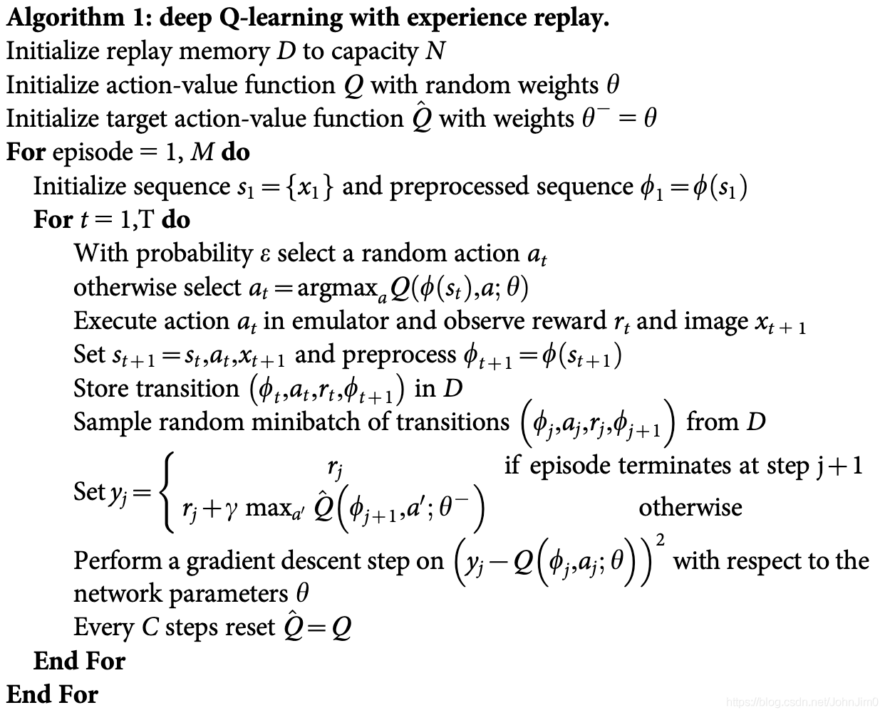

1. 初始化
   - [x] replay memory
   - [x] Action-value function Q 随机权重
   - [x] target Action-value function Q‘ 与Q一样的权重

2. 每一个episode循环
   1. action(epsilon greedy:随机/argmax)
   2. 计算reward
   3. 计算s_{t+1}
   4. D中存储(obs,action,reward,next_obs)
   5. target Q 输入next_obs计算td_error
   6. 梯度更新Q
   7. 每隔几个batch同步target Q