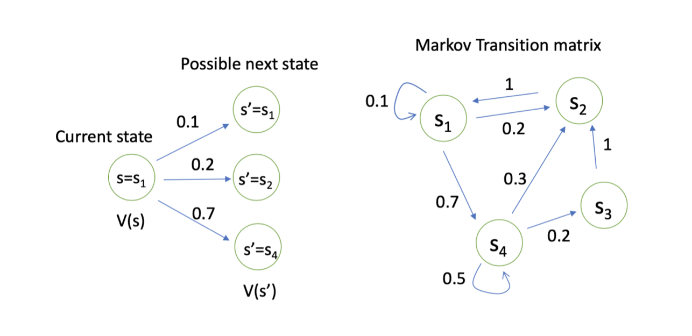
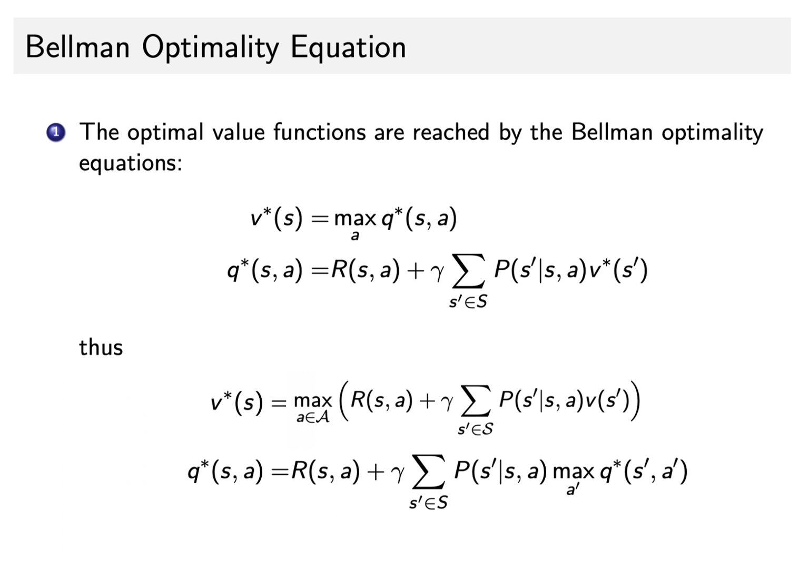

# MDP(马尔可夫决策过程)

## 1. 基本概念

- 

- agent 在得到环境的状态过后，它会采取动作，它会把这个采取的动作返还给环境。环境在得到 agent 的动作过后，它会进入下一个状态，把下一个状态传回 agent。
- MDP中，他的环境是**全部可观测的**
- **马尔可夫性质**：从当前状态转移到下一个状态的概率，等于包含当前状态和之前所有状态的序列转移到下一个状态的概率
- **马尔可夫链**：一系列从当前状态转移到下一状态的概率，对一系列转移进行采样就得到了**轨迹trajectory**

## 2. **马尔可夫奖励过程**：

- **`马尔可夫奖励过程(Markov Reward Process, MRP)` 是马尔可夫链再加上了一个奖励函数**

- 奖励函数：**奖励函数 R 是一个期望**，就是说你到达某一个状态的时候，可以获得多大的奖励
- 理解：如果把agent看作纸船，纸船本身没有动力，放在河里随波逐流(追逐奖励)的过程就是马尔可夫奖励过程

- Horizon：一个回合的长度（每个回合最大的时间步数），它是由有限个步数决定的。

- Return：把奖励进行折扣后所获得的收益。Return 可以定义为奖励的逐步叠加，如下式所示：

- $$
  G_{t}=R_{t+1}+\gamma R_{t+2}+\gamma^{2} R_{t+3}+\gamma^{3} R_{t+4}+\ldots+\gamma^{T-t-1} R_{T}
  $$

- 价值函数：

$$
\begin{aligned}
  V_{t}(s) &=\mathbb{E}\left[G_{t} \mid s_{t}=s\right] \\
  &=\mathbb{E}\left[R_{t+1}+\gamma R_{t+2}+\gamma^{2} R_{t+3}+\ldots+\gamma^{T-t-1} R_{T} \mid s_{t}=s\right]
  \end{aligned}
$$

- 计算return：

  

- 在能计算return的情况下如何计算某特定状态对应的价值函数：

  - 对于当前状态后的所有trajectory的return进行采样累加(蒙特卡洛积分)

  - Bellman等式：当前状态的reward加上未来可能的状态reward乘以折扣因子累加

  - $$
    V(s)=\underbrace{R(s)}_{\text {Immediate reward }}+\underbrace{\gamma \sum_{s^{\prime} \in S} P\left(s^{\prime} \mid s\right) V\left(s^{\prime}\right)}_{\text {Discounted sum of future reward }}
    $$

  - 

  - 计算所有的价值函数：根据bellman等式不断迭代直到状态收敛

## 3. 马尔可夫决策过程

- **状态转移函数**：在马尔可夫奖励过程的基础上多了行为action，采取不同的行动未来的状态会不同
- **奖励**：在马尔可夫奖励过程的基础上多了行为action，奖励根据当前状态当前行为决定
- **决策函数**：输入当前状态，得到当前行动的概率
- 马尔可夫决策过程转为**马尔可夫奖励过程**：
  - 状态转移函数为采取全部可能行动得到的状态概率积分
  - 奖励为采取全部可能行动得到的当前状态奖励均值

- 价值函数Q-函数：
  $$
  q^{\pi}(s, a)=\mathbb{E}_{\pi}\left[G_{t} \mid s_{t}=s, A_{t}=a\right] \tag{4}
  $$

- 价值函数：价值函数就是所有动作可能性的q函数的加和

- $$
  q^{\pi}(s, a)=R(s, a)+\gamma \sum_{s^{\prime} \in S} P\left(s^{\prime} \mid s, a\right) \sum_{a^{\prime} \in A} \pi\left(a^{\prime} \mid s^{\prime}\right) q^{\pi}\left(s^{\prime}, a^{\prime}\right) \tag{11}
  $$

- 计算示例：

  

- 核心问题：
  - 预测问题（prediction）
    - 给定一个policy，计算价值函数
    
  - 决策问题（control）
    - 找到状态对应的最优价值函数和最优决策（一般最优价值函数只有一个，但是最优决策可以有多个）
    
    - $$
      v^{*}(s)=\max _{\pi} v^{\pi}(s)
      $$
    
    - $$
      \pi^{*}(s)=\underset{\pi}{\arg \max }~ v^{\pi}(s)
      $$

## 4. 决策问题的计算方法

- ### policy iteration

  - 初识一个价值函数v和策略函数pi
  - Policy evaluation: 
    - 根据当前的pi和v算出v函数
  - Policy Improvement: 
    - 

- ### value iteration

  - bellman optimality equation

  - 理解：考虑一个确定性的policy pi(a|s)取能让q函数最大的a的概率是1，则价值也是最优的，有如下等式:

  - 即最佳策略下的一个状态的价值必须等于在这个状态下采取最好动作得到的回报的期望
    $$
    v^{\pi}(s)=\max _{a \in \mathcal{A}} q^{\pi}(s, a
    $$

  - 

  - $$
    \begin{aligned}
    v^{*}(s)&=\max _{a} q^{*}(s, a) \\
    &=\max_{a} \mathbb{E}[G_t|s_t=s,a_t=a]\\  
    &=\max_{a}\mathbb{E}[R_{t+1}+\gamma G_{t+1}|s_t=s,a_t=a]\\
    &=\max_{a}\mathbb{E}[R_{t+1}+\gamma v^*(s_{t+1})|s_t=s,a_t=a]\\
    &=\max_{a}\mathbb{E}[R_{t+1}]+ \max_a \mathbb{E}[\gamma v^*(s_{t+1})|s_t=s,a_t=a]\\
    &=\max_{a} R(s,a) + \max_a\gamma \sum_{s^{\prime} \in S} P\left(s^{\prime} \mid s, a\right) v^{*}\left(s^{\prime}\right)\\
    &=\max_{a} \left(R(s,a) + \gamma \sum_{s^{\prime} \in S} P\left(s^{\prime} \mid s, a\right) v^{*}\left(s^{\prime}\right)\right)
    \end{aligned}
    $$

  - 上述公式可以理解为：第一步执行最优的action，之后每一步的状态采取最优policy，最后达到的价值函数就是最优的

  - 不断迭代，最终收敛就能得到最优的value
  - 

- 可视化网站：https://cs.stanford.edu/people/karpathy/reinforcejs/gridworld_dp.html