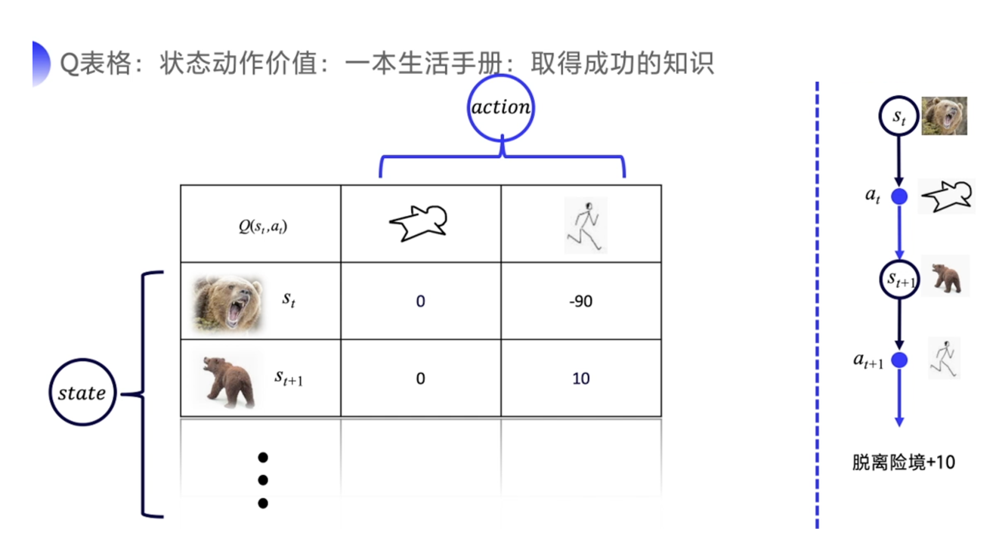
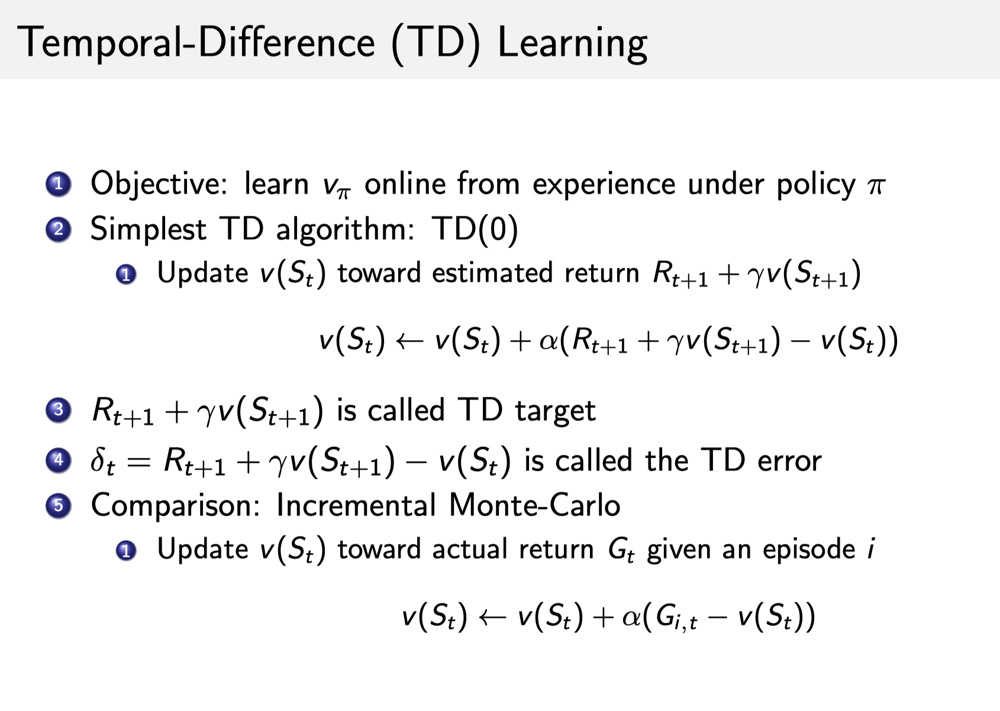
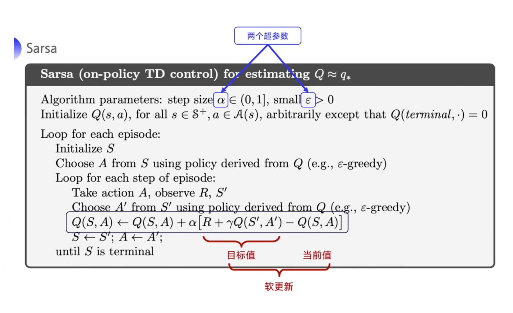

# Tabular Methods（表格型方法）

## Model-based

- 之前学习的方法都是已知rewad，状态转移函数的，也就是能描述环境的，存在模型的方法
- 存在模型的方法用之前的动态规划类的方法就可以解决

## Model-free Prediction

- 状态转移函数和奖励函数未知

- agent和环境交互，采集到很多trajectories，通过trajectories改进策略

- 最终想要得到的是这样一张表格，由该表格来指引决策

  

- **`强化`就是我们可以用下一个状态的价值来更新当前状态的价值，其实就是强化学习里面 bootstrapping 的概念。**在强化学习里面，你可以每走一步更新一下 Q 表格，然后用下一个状态的 Q 值来更新这个状态的 Q 值，这种单步更新的方法叫做`时序差分`。

- 方法：
  - Monte-Carlo Policy Evaluation
    - 生成很多轨迹，求轨迹rewards平均
    - 最终得到的是**empirical mean return**而不是**expected reward**
    - 只能用在**有终止的MDP**上
    - 一些数学方法可以把Monte-Carlo转成增量型的迭代计算，但是上述三条性质不会改变
  - Temperal Difference Learning
    - 理解：肉给狗-->狗分泌唾液(无条件刺激) 铃声-->肉给狗--->狗分泌唾液(中性刺激) 铃声--->狗分泌唾液(产生无条件刺激)
    - **这种中性刺激跟无条件刺激在时间上面的结合，我们就称之为强化。** 强化的次数越多，条件反射就会越巩固。
    - [TD Learning可视化网站](https://cs.stanford.edu/people/karpathy/reinforcejs/gridworld_td.html)
    - 上述Demo中小球对周围状态进行探索，最开始会发现一些能获得reward的格子，后来这些格子附近的格子的value也会被影响
    - 
      - 上述图片中TD target是对未来折扣reward的估计值
      - 为什么是估计值？因为TD target是对期望折扣reward的采样，而且计算采用的是当前估计值v，非真实值
  - TD vs MC：
    - TD走一步就可以更新估计值，不用等轨迹结束，更适合在线学习
    - TD可以从不完整序列上学习，MC只能从完整序列上学习
    - TD可以在没终止状态的情况下学习，MC只适用于有终止的情况
    - 举例：
      - TD 会在路口 A 就开始更新预计到达路口 B、路口 C \cdots \cdots⋯⋯，以及到达公司的时间；
      - 而 MC 并不会立即更新时间，而是在到达公司后，再修改到达每个路口和公司的时间。
- 

## Model-free control

- 前一章说的policy iteration适用于解决已知状态转移函数和Reward的MDP

- 在不知道的情况下，只需要将policy iteration的第一步policy evaluation用相应的model-free prediction方法计算即可

- 贪心系数：

  - e为10%代表agent有90%的概率根据q函数选下一个action，有10%的概率执行随机的动作
  - e越大，agent的行为越偏向探索；e越小，agent的行为越偏向利用现有知识
  - 往往在agent学习到后期时需要减小e，减小random行为

- Sarsa(On-policy TD control)：

  - Sarsa做出的改变就是把原来TD算法里的计算V变成了计算Q

  - 根据Q-Table下一步状态下一步action和Reward去更新当前状态当前action的Q

  - **该算法由于每次更新值函数需要知道当前的状态(state)、当前的动作(action)、奖励(reward)、下一步的状态(state)、下一步的动作(action)，即 $(S_{t}, A_{t}, R_{t+1}, S_{t+1}, A_{t+1})$ (St,At,Rt+1,St+1,At+1) 这几个值 ，由此得名 `Sarsa` 算法**。它走了一步之后，拿到了 $(S_{t}, A_{t}, R_{t+1}, S_{t+1}, A_{t+1})$ (St,At,Rt+1,St+1,At+1) 之后，就可以做一次更新。

  - $$
    Q\left(S_{t}, A_{t}\right) \leftarrow Q\left(S_{t}, A_{t}\right)+\alpha\left[R_{t+1}+\gamma Q\left(S_{t+1}, A_{t+1}\right)-Q\left(S_{t}, A_{t}\right)\right]
    $$

  - 

  - 在上述sarsa算法的基础上，计算t+1到t+n目标值的总和就是n-step sarsa算法，在n-step目标值前乘以衰减因子lambda，就是lamda sarsa算法

- Q-learning (off-policy TD control)

  - sarsa是一种on-policy策略，优化的是实际执行的策略，直接拿执行下一步的action去优化Q-table；即用来选取action的策略和用来优化的策略是同一种策略
  - off-policy在学习过程中，有两种策略：
    - target policy，一般用pi表示，是我们要去学习的策略，它根据自己的经验学习最优的策略，而不与环境做交互
    - behavior policy，一般用mu来表示，mu可以去探索所有可能的轨迹，并采集轨迹采集数据，把数据喂给target policy去学习
  - off-policy的好处
    - 可以利用 behavior policy 来学到一个最佳的策略，学习效率高；
    - 可以学习其他 agent 的行为，模仿学习，学习其他 agent 产生的轨迹；
    - 重用老的策略产生的轨迹，可以节省资源。

  - 
    - Sarsa 在更新 Q 表格的时候，它用到的 A' 。我要获取下一个 Q 值的时候，A' 是下一个 step 一定会执行的 action。这个 action 有可能是 \varepsilonε-greedy 方法采样出来的值，也有可能是 max Q 对应的 action，也有可能是随机动作，但这是它实际执行的那个动作。
    - 但是 Q-learning 在更新 Q 表格的时候，它用到这个的 Q 值 Q(S',a)Q(S′,a) 对应的那个 action ，它不一定是下一个 step 会执行的实际的 action，因为你下一个实际会执行的那个 action 可能会探索

  - Sarsa是Q-learning的改进，Q-learning因为没有考虑实际的行为而是直接用最大值计算，它的表现会比Sarsa大胆

  - Q-learning悬崖寻路算法示例：

    

    ```python
    '''初始化环境'''  
    env = gym.make("CliffWalking-v0")  # 0 up, 1 right, 2 down, 3 left
    env = CliffWalkingWapper(env)
    agent = QLearning(
        state_dim=env.observation_space.n,
        action_dim=env.action_space.n,
        learning_rate=cfg.policy_lr,
        gamma=cfg.gamma,
    rewards = []  
    ma_rewards = [] # moving average reward
    for i_ep in range(cfg.train_eps): # train_eps: 训练的最大episodes数
        ep_reward = 0  # 记录每个episode的reward
        state = env.reset()  # 重置环境, 重新开一局（即开始新的一个episode）
        while True:
            action = agent.choose_action(state)  # 根据算法选择一个动作
            next_state, reward, done, _ = env.step(action)  # 与环境进行一次动作交互
            agent.update(state, action, reward, next_state, done)  # Q-learning算法更新
            state = next_state  # 存储上一个观察值
            ep_reward += reward
            if done:
                break
        rewards.append(ep_reward)
        if ma_rewards:
            ma_rewards.append(ma_rewards[-1]*0.9+ep_reward*0.1)
        else:
            ma_rewards.append(ep_reward)
        print("Episode:{}/{}: reward:{:.1f}".format(i_ep+1, cfg.train_eps,ep_reward))
    ```

    
