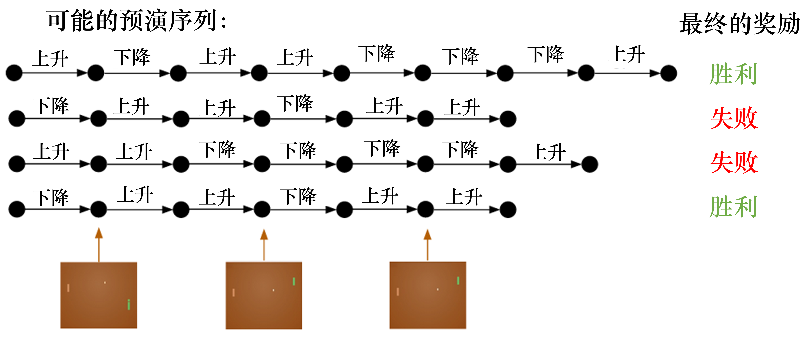

# 强化学习笔记

1. # 基本概念

   - 强化学习和监督学习的对比：

     - 监督学习：每个样本**独立同分布**；label告诉学习器正确的样本是什么，学习器**通过正确的标签修正预测**
     - 强化学习：每一个决策有相当强的**连续性**，**不满足独立同分布**；反馈不是立刻的，存在**延迟奖励**

   - 强化学习特征：

     - 强化学习有这个 `试错探索(trial-and-error exploration)`，它需要通过探索环境来获取对环境的理解。
     - 强化学习 agent 会从环境里面获得延迟的奖励。
     - 在强化学习的训练过程中，时间非常重要。因为你得到的数据都是有时间关联的(sequential data)，而不是独立同分布的。在机器学习中，如果观测数据有非常强的关联，其实会使得这个训练非常不稳定。这也是为什么在监督学习中，我们希望数据尽量是独立同分布，这样就可以消除数据之间的相关性。
     - Agent 的行为会影响它随后得到的数据，这一点是非常重要的。在我们训练 agent 的过程中，很多时候我们也是通过正在学习的这个 agent 去跟环境交互来得到数据。所以如果在训练过程中，这个 agent 的模型很快死掉了，那会使得我们采集到的数据是非常糟糕的，这样整个训练过程就失败了。所以在强化学习里面一个非常重要的问题就是怎么让这个 agent 的行为一直稳定地提升。

   - 经典强化学习示例：

     - environment是一个游戏，强化学习模型需要做出挡板向上或向下移动的决策

     - 

     - 不同于监督学习，强化学习是让agent做出一系列决策，在决策之后再得出得分，这个过程叫做`rollout` 得到的一系列决策为`trajectory`, 表示当前状态和一系列决策。

     - $$
       \tau=\left(s_{0}, a_{0}, s_{1}, a_{1}, \ldots\right)
       $$

3. ## 序列决策

   - 基本概念

     - 历史是观测(observation)，决策，奖励的序列

     - $$
       H_{t}=O_{1}, R_{1}, A_{1}, \ldots, A_{t-1}, O_{t}, R_{t}
       $$

     - 整个游戏的状态是关于这个历史的函数

     - $$
       S_{t}=f\left(H_{t}\right)
       $$

   - 状态和观测

     - 状态s是对**世界的完整描述**，观测o是对**状态的部分描述**

     - 环境有自己的函数$f^e(H_t)$来更新状态$S^e$，agent有自己的函数$f^a(H_t)$来更新状态$S^a$

       - 当$S^e=S^a$时，这个环境是**完全可观测**的，经常被建模为MDP，在MDP中，**每时刻的观测等于每时刻的环境状态等于每时刻的agent状态**（*<u>我构想的动态部署模型的属性是可完全观测的</u>*）

       - 对于部分情况来说，**环境状态和agent状态是不等价的**，即**不可完全观测**，比如扑克牌游戏，ai牌手并不能知道对手的牌面信息

4. ## 强化学习组成

   - **策略函数(policy function)**

     - agent用该函数选择下一步动作
     - 输入：状态    输出：行为
     - 分类
       - 随机性策略 
         - $\pi(a | s)=P\left[A_{t}=a | S_{t}=s\right]$
         - 输入是状态，输出是一个概率分布（例如有70%概率向右走，30%概率向左走），对该概率分布进行采样得到action
       - 确定性策略
         - 确定性的，例如**极大化策略**，采取使概率最大的行为；或者设置阈值都是确定性策略
     - 通常情况下，**强化学习采用随机性策略**，能够更好的探索环境同时不被对手预测到下一步
     - （*<u>我构想的动态部署模型采用确定性策略</u>*）

   - **价值函数(value function)**

     - 对当前状态估价，表示**进入该状态**可能对未来造成多大的影响；**价值函数越大，代表该状态越有利**

     - 下述价值函数是在**确定的策略函数$pi$**，**状态为s的情况下从当前时刻到未来的期望奖励累加**，这里面的$\gamma$代表折扣因子，**折扣因子**决定了在短时间内获得更多奖励更有利

     - $$
       v_{\pi}(s) \doteq \mathbb{E}_{\pi}\left[G_{t} \mid S_{t}=s\right]=\mathbb{E}_{\pi}\left[\sum_{k=0}^{\infty} \gamma^{k} R_{t+k+1} \mid S_{t}=s\right], \text { for all } s \in \mathcal{S}
       $$

     - $$
       q_{\pi}(s, a) \doteq \mathbb{E}_{\pi}\left[G_{t} \mid S_{t}=s, A_{t}=a\right]=\mathbb{E}_{\pi}\left[\sum_{k=0}^{\infty} \gamma^{k} R_{t+k+1} \mid S_{t}=s, A_{t}=a\right]
       $$

     - 上述的价值函数是**Q函数**，它表示在**确定的策略函数$pi$**，**状态为s的情况下采取行动a从当前时刻到未来的期望奖励累加**，可以通过该函数确定在某个状态下的**最优行为**

   - **模型**

     - 模型决定了**当前的状态和行为下，你的下一个状态是什么**

     - 组成

       - 状态转移概率

       - $$
         \mathcal{P}_{s s^{\prime}}^{a}=\mathbb{P}\left[S_{t+1}=s^{\prime} \mid S_{t}=s, A_{t}=a\right]
         $$

       - 奖励函数

       - $$
         \mathcal{R}_{s}^{a}=\mathbb{E}\left[R_{t+1} \mid S_{t}=s, A_{t}=a\right]
         $$

5. ## 强化学习Agent类别

   - 基于价值的agent(value-based agent)
     - 显式学习价值策略
     - 在当前状态，计算当前action space的action能到达的状态对应的价值，比较价值大小，选择价值最大的状态
   - 基于决策的agent(policy-based agent)
     - 学习policy，给定状态，输出action概率
   - 两者结合，actor- critic agent
     - 学习策略函数和价值函数，两者交互得到最佳行为
   - 总结：
     - 在`基于策略迭代`的强化学习方法中，智能体会`制定一套动作策略`（确定在给定状态下需要采取何种动作），并根据这个策略进行操作。强化学习算法直接对策略进行优化，使制定的策略能够获得最大的奖励。(策略梯度算法)
     - 而在`基于价值迭代`的强化学习方法中，智能体不需要制定显式的策略，它`维护一个价值表格或价值函数`，并通过这个价值表格或价值函数来选取价值最大的动作。基于价值迭代的方法只能应用在不连续的、离散的环境下。(Q-learning,Sarsa)
     -  Actor-Critic 算法同时使用策略和价值评估来做出决策，其中，智能体会根据策略做出动作，而价值函数会对做出的动作给出价值，这样可以在原有的策略梯度算法的基础上加速学习过程，取得更好的效果。

- 
  - model-based agent
    - 把现实环境建模成为<S,A,P,R>四元组，分别为状态集合，动作集合，状态转移函数，奖励函数
    - 如果这四元组中所有元素均已知，且状态集合和动作集合在有限步数内是有限集，则机器可以对真实环境进行建模，构建一个虚拟世界来模拟真实环境的状态和交互反应。
    - **通常情况下，状态转移函数和奖励函数很难估计，甚至连环境中的状态都可能是未知的，这时就需要采用免模型学习。**
  - model-free agent
    - 没有对真实环境进行建模，智能体只能在真实环境中通过一定的策略来执行动作，等待奖励和状态迁移，然后根据这些反馈信息来更新行为策略，这样反复迭代直到学习到最优策略

6. ## 学习资源

   - 强化学习代码examples：https://github.com/cuhkrlcourse/RLexample
   - 强化学习书籍：https://datawhalechina.github.io/easy-rl/#/chapter1/chapter1
   - 简单强化学习环境仿真库：https://gym.openai.com/